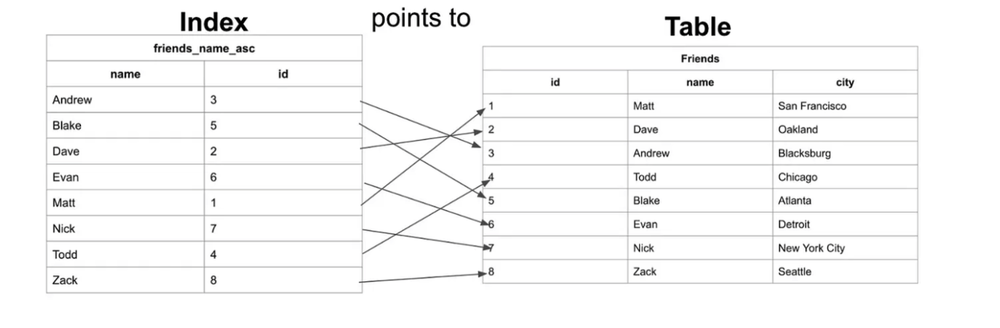
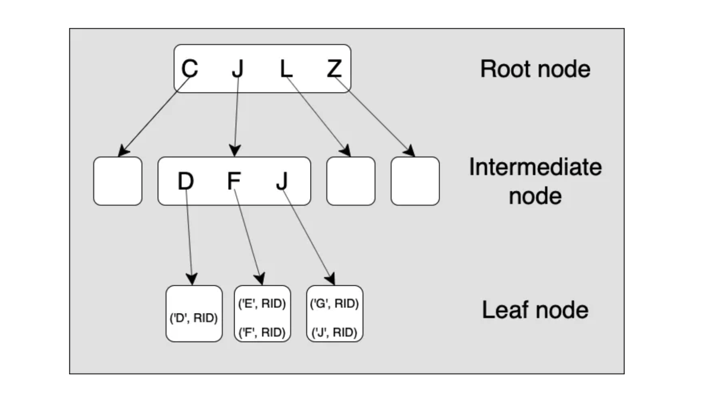
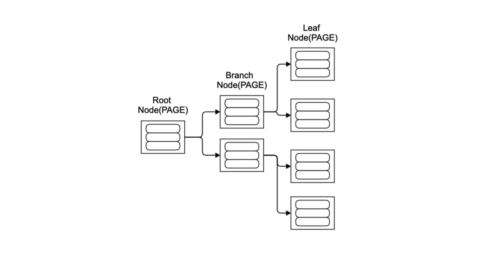
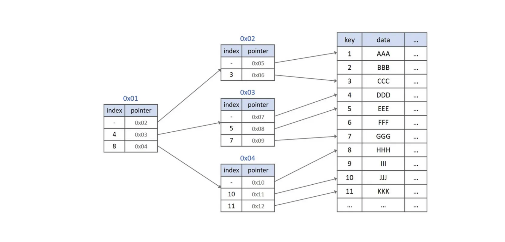

### 인덱스(index)란?

인덱스란 빠르게 데이터를 찾을 때 사용하는 자료구조다. 보다 정확히, Database에서의 Index는 추가적인 쓰기 및 저장 공간을 통해, Table에 대한 데이터 검색 속도를 향상시키는 자료구조다.

데이터를 모두 검색하는 건 비효율적인데, index를 사용하면 효율적인 이유는 균형 잡힌 트리 구조와 트리 깊이의 대수확장성에 있다. 트리의 깊이가 리프 노드 수에 비해 상대적으로 느리게 증가하기 때문이다.

인덱스는 비트맵, 해시, B+Tree 등 다양한 방식으로 구현할 수 있다.

### 쉽게 생각해보면

예를 들어, 1부터 100까지의 숫자 중에서 51을 찾아야 한다면? 1부터 51까지 일일이 찾으려면 51개를 찾아야 한다. 그게 아니라 절반씩 나눠 찾는 방식이 훨씬 빠르다. 이렇게 트리 구조로 탐색하면 전체 노드의 개수보다 트리 깊이의 수가 압도적으로 적으므로 효율적이라는 것이다.

이때 이렇게 나눠서 찾으려면 노드들이 정렬되어 있어야 한다. 그래서 해당 데이터를 복사해 정렬한 채로 둔 걸 인덱스(Index)라고 하는 것이다. 빠르지만, 인덱스를 사용하기 위해 정렬을 해야 하며 정렬된 복사본을 저장할 별도의 공간이 필요하므로 이게 단점이 될 수도 있다.

### 해시 테이블 Hash Table

해시 테이블은 key-value 형태로 데이터를 저장하는 자료구조 중 하나다. key를 통해 고유 index를 만들고, 해시 함수를 통해 특정 key 값을 넣으면, 값을 읽을 수 있다. 이 값에는 직접적인 해시 값 혹은 주소가 담겨 있어 해시테이블의 특정 데이터에 접근할 수 있다.

데이터 검색 시 시간복잡도가 O(1)이므로 검색이 매우 빠르다.

- 다만, 저장 공간을 많이 차지할 수 있으며 key가 중복될 수 있어 연결리스트와 같은 자료구조가 추가적으로 필요하다.
- 게다가 해시는 등호(=) 연산에만 특화되어 있으므로, 부등호 연산(>, <)이 자주 사용되는 데이터베이스 검색에는 잘 사용되지 않는다.
- 데이터를 변경하면, 인덱스에도 반영해줘야 한다. 그래서 데이터 수정, 삭제에 추가 비용이 든다.

### B-Tree (Balanced Tree)

정렬을 하고, 트리 구조를 통해 탐색하면 효율적이지만, N개(2개 이상)의 자식 노드를 가질 수 있도록 하면 더 효율적일 것이다. 범위를 더 빠르게 좁혀나갈 수 있기 때문이다. 좌우 자식 간 균형이 맞지 않으면 매우 비효율적이므로 항상 균형을 맞춘다는 의미에서 균형 트리(Balanced Tree)라고 한다. 자식노드를 많이 뒀는데, 균형이 맞지 않으면 최악의 경우 더 비효율적일 수 있기 때문이다.

최상위 노드를 Root 노드, 최하단 노드들을 Leaf 노드, 그리고 그 사이 노드를 Branch 노드라고 한다. 인덱스는 페이지 단위로 저장되며, 인덱스 키를 바탕으로 항상 정렬된 상태를 유지한다.

### B+Tree

B-Tree의 경우 노드를 정확히 찾아야 한다. 이를 해결하기 위해 등장한 게 B+Tree다. 기존 B-Tree의 데이터는 모두 Leaf 노드로 내려오며, 이 리프 노드들은 연결리스트로 연결되어 있어 순차 탐색에 유리하다. 그러므로 데이터의 삽입/삭제 연산은 리프 노드에서만 발생한다.

### 참고자료

[CS 지식의 정석 | 디자인패턴 네트워크 운영체제 데이터베이스 자료구조](https://www.inflearn.com/course/%EA%B0%9C%EB%B0%9C%EC%9E%90-%EB%A9%B4%EC%A0%91-cs-%ED%8A%B9%EA%B0%95) 
[Database index](https://en.wikipedia.org/wiki/Database_index) 
[Indexing](https://dataschool.com/sql-optimization/how-indexing-works/) 
[[Database] 인덱스(index)란?](https://mangkyu.tistory.com/96) 
[[MySQL] B-Tree로 인덱스(Index)에 대해 쉽고 완벽하게 이해하기](https://mangkyu.tistory.com/286) 
[What is a Database Index?](https://www.codecademy.com/article/sql-indexes) 
[[자료구조] 그림으로 알아보는 B+Tree](https://velog.io/@emplam27/%EC%9E%90%EB%A3%8C%EA%B5%AC%EC%A1%B0-%EA%B7%B8%EB%A6%BC%EC%9C%BC%EB%A1%9C-%EC%95%8C%EC%95%84%EB%B3%B4%EB%8A%94-B-Plus-Tree) 
