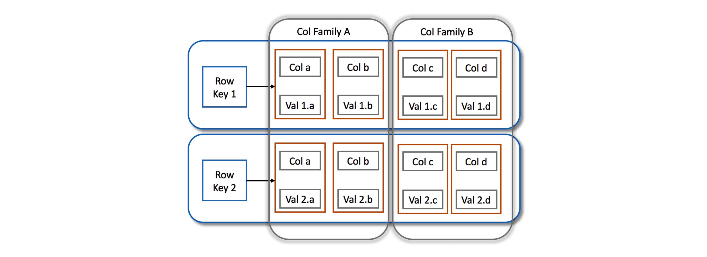
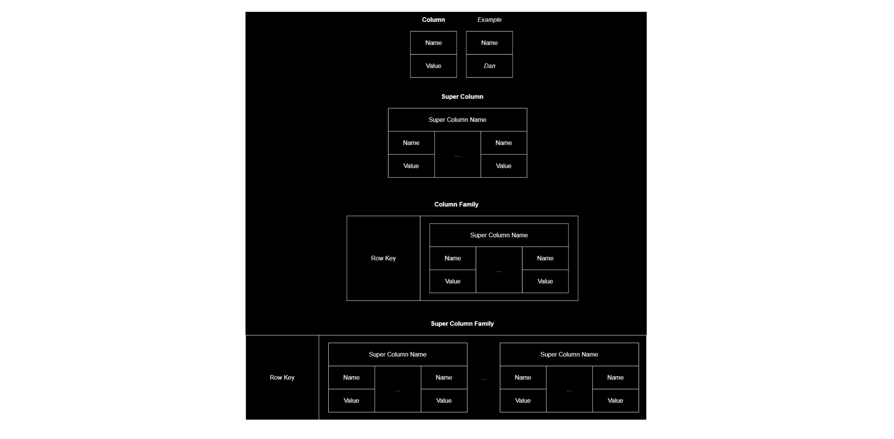
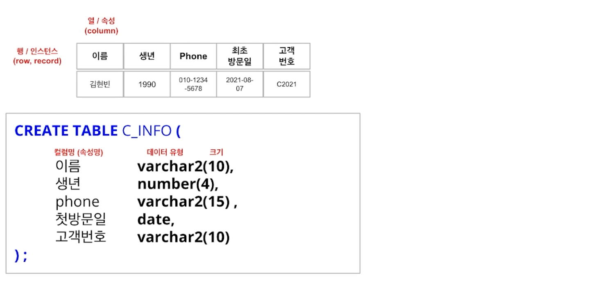
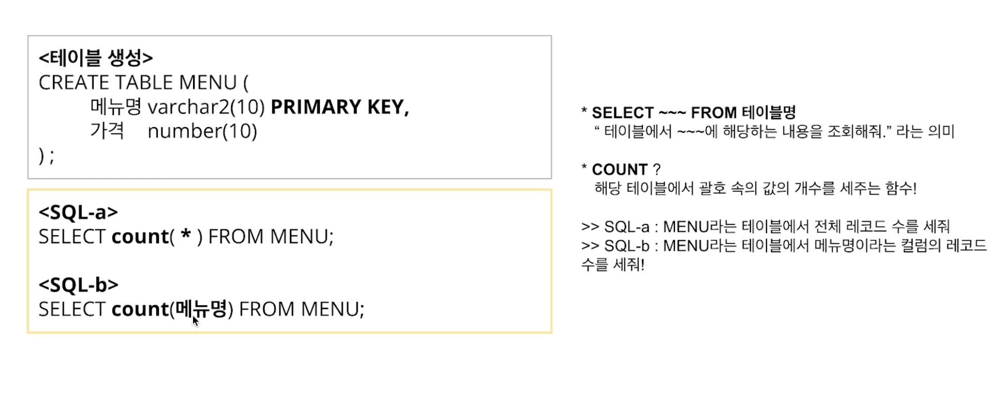
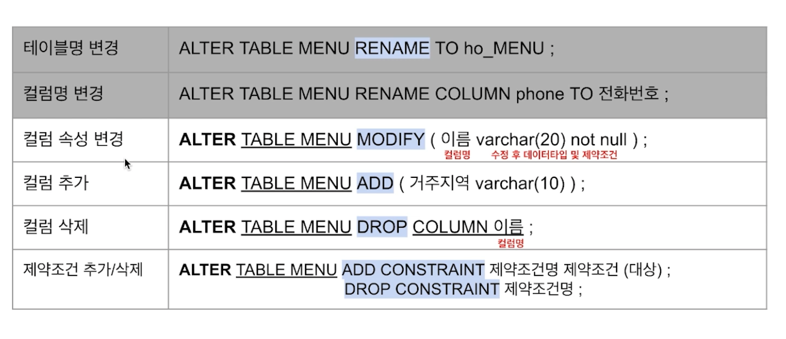

## Database & SQL

data : 정보 구성하는 최소 단위<br>
database : data 저장, 관리하는 공간<br>
data modeling : data의 핵심 정보를 이해할 수 있도록 전산화해서 공유하는 작업 (단순화, 추상화, 정확성)

sql : 관계형 데이터베이스에 접근하기 위한 언어 (Structured Query Language)

- `열(속성,column)과 행(인스턴스,row | record)`으로 구성된 테이블로 데이터를 표현하는 관계형 데이터베이스
- `데이터 정의(Data Definition/DDL)`, `데이터 조작(Data Manipulation/DML)`, `조작한 결과를 적용/취소(Transaction Control/TCL)`, `접근 권한을 제어(Data Control/DCL)`로 구성됨





## DCL

DCL(Data Control Language)

- GRANT : 권한 부여
- REVOKE : 권한 회수

권한 종류 (SELECT, INSERT, UPDATE, DELETE, REFERENCES, ALTER, INDEX, ALL)

```sql
-- GRANT 권한 ON 테이블명 TO 유저명
-- WHERE 조건문을 사용 가능하도록 SELECT 권한도 부여
GRANT SELECT, UPDATE ON <테이블명> TO <유저이름>;
```

db 상에서 권한 부여 개별적으로 하지 않고 묶어서 할 수 있게 하는 것 : ROLE (ex, `GRANT 관리자권한 TO USER;`)

## DDL

DDL(Data Definition Language)



컬럼명 : 영문,한글,숫자 모두 가능 (시작은 문자로만)<br>
데이터 유형

- char : 고정길이 문자열
- varchar2: 가변길이 문자열
- number : 숫자형
- date : 날짜형

### 1. CREATE : 구조 생성

- default 기본값 지정
- not null : null 입력 불가
- primary key : 기본키 지정 (PK는 not null, unique)
- foregin key : 외래키 지정

제약조건 추가 방법 : CONSTRAINT, with

- `CONSTRAINT <제약조건 명칭> <제약조건 종류> <대상 컬럼명>`



테이블 생성 시,

- `A-Z, a-z, 0-9, #, $, _` 만 사용 가능
- 테이블명,칼럼명은 문자로 시작
- 다른 테이블명과 중복x
- 칼럼 뒤 데이터 유형 반드시 지정

### 2. ALTER : 구조 변경

테이블과 칼럼의 이름/속성 변경 및 추가/삭제 등 구조 수정

db마다 TO를 붙여도 되고 안 붙여도 되고 (mysql은 안 붙여도 됨)

```sql
-- 테이블명 변경
ALTER TABLE <테이블명> RENAME (TO) <변경할 값>;
-- 컬럼명 변경
ALTER TABLE <테이블명> RENAME COLUMN <칼럼명> (TO) <변경할 값>;
```



`MODIFY`와 `ADD CONSTRAINT` 비교

- 대표적인 제약조건 5가지(NOT NULL, UNIQUE, PRIMARY KEY, FOREGIN KEY, CHECK) 중, NOT NULL만 MODIFY를 사용하고 나머지는 ADD를 사용할 것

### 3. DROP : 구조 삭제

```sql
-- 컬럼 삭제
ALTER TABLE <테이블명> DROP COLUMN <컬럼이름>
-- 테이블 삭제
DROP TABLE <테이블명>
-- 테이블 삭제 (외래키를 참조한 제약사항도 전부 삭제) (oracle에만 존재하고 sql server에는 없는 옵션 / FK 제약조건과 참조테이블 먼저 삭제 후 테이블 삭제함)
DROP TABLE <테이블명> CASCADE CONSTRAINT
```

### 4. RENAME : 이름 변경

### 5. TRUNCATE : 테이블 초기화

```sql
-- 테이블 삭제 (전부 삭제)
DROP TABLE <테이블명>
-- 테이블 초기화 (초기 상태로, 뼈대만 남김)
TRUNCATE TABLE <테이블명>
```

## 참고자료

[Wide-Column Databases](https://dandkim.com/wide-column-databases/)<br>
