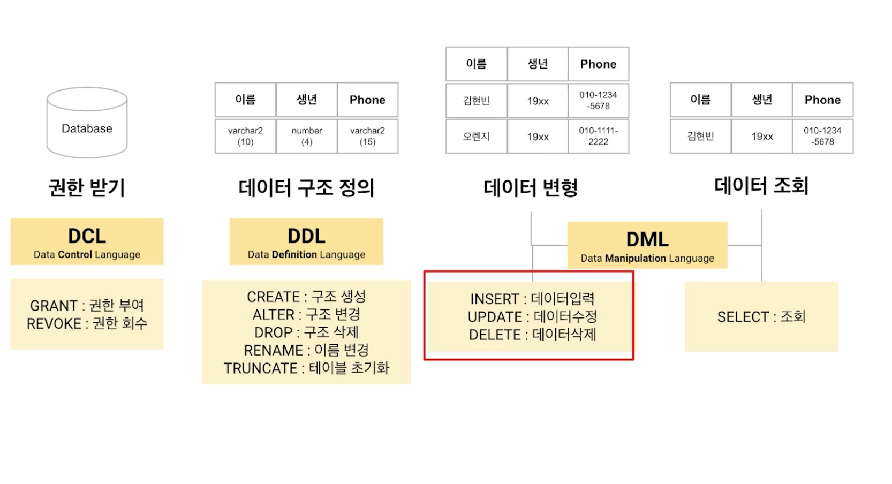

## DML과 TCL | SELECT 문 기본 구조(DISCINCT, COUNT, 기본 함수, DECODE, CASE WHEN, ORDER)

### DML



DML(Data Manipulation Language) : 정의된 db에 record를 입력하거나, 수정/삭제/조회하기 위한 명령어.

- INSERT(데이터 입력) : `INSERT INTO <테이블명> <컬럼명> VALUES <값>`
- UPDATE(데이터 수정) : `UPDATE <테이블명> SET <수정대상 컬럼명>=<수정값> (WHERE <수정대상 레코드 조건>)`
- DELETE(데이터 삭제) : `DELETE FROM <테이블명> (WHERE <수정대상 레코드 조건>)`

참고로,

- DELETE에서 FROM 생략 가능.
- 숫자는 varchar2와 char에 입력 가능.
- INSERT 시에, not null인 컬럼을 반드시 채워넣어야 한다.
- INSERT 시에, 컬럼명이 지정되지 않은 경우 전체 컬렘에 값을 넣어야 한다. (값이 없어도 콤마(,)로 명시해야 함) `INSERT INTO <테이블명> VALUES ('102', '와규', 30000, )`

#### DELETE 깊게 이해하기


DELETE의 경우,

- db에 반영되기 전까지는 삭제한 것을 되돌릴 수 있으며
- 데이터를 삭제하더라도 테이블 용량이 줄어들지는 않는다.
- 조건문을 통해 특정 데이터만 지울 수 있다.

### TCL (Transaction Control Language)


TCL은 데이터 변경사항을 어디까지 DB에 반영하지?에 대한 답.


TCL은 트랜잭션을 제어하기 위한 언어이다.


```sql
ROLLBACK TO SAVEPOINT <세이브포인트명>
ROLLBACK SAVEPOINT <세이브포인트명>
ROLLBACK
```

#### Commit과 Rollback 효과

COMMIT : 데이터에 대한 변화를 db에 반영하기 위한 명령어<br>
SAVEPOINT : 코드를 분할하기 위한 저장 포인트 지정<br>
ROLLBACK : 트랜잭션이 시작되기 이전의 상태로 되돌리기 위한 언어. 최신 COMMIT이나 특수한 SAVEPOINT로 되돌릴 수 있는 명령어.

1. 데이터 무결성 보장
2. 영구적인 변경 전 데이터 변동사항 확인 가능
3. 논리적 연관성 있는 작업을 그룹화하여 처리 가능

#### 데이터 무결성이란? => db에 저장된 데이터의 정확성, 일관성을 유지하고 보증하는 것

- 정확성 : 중복이나 누락이 없는 상태 (같은 데이터가 여러 번 저장x)
- 일관성 : 원인과 결과의 의미가 연속적으로 보장되어 변하지 않는 상태

#### 무결성 제약조건 (Integrity Constraint)

무결성 제약조건 : db의 정확성, 일관성(무결성)을 보장하기 위해 저장/삭제/수정 등을 제약하기 위한 조건

1. 개체 무결성 (기본키 제약)

- 테이블은 기본키를 지정하고, 그에 따른 무결성을 지켜야 함
- 기본키에는 NULL 값이 올 수 없음
- 기본키는 테이블 내에 오직 하나의 값만 존재해야 함 (동일한 기본키를 가진 레코드가 테이블 내에 여러 개일 수 없다.)

2. 참조 무결성 (외래키 제약)

- 외래키 값은 NULL이거나 참조하는 relation의 기본키 값과 동일해야 함. ([결제]에서 [고객]의 회원번호를 참조하면, 있는 회원번호만 가져와야 함)

3. 도메인 무결성

- 속성값은 속성의 도메인 속한 값 (초등학교 학년 1-6)

4. 고유 무결성

- UNIQUE 조건이 주어진 컬럼의 속성값은 서로 달라야 함

5. NULL 무결성

- NOT NULL로 제한하면 NULL이 와선 안 됨

#### Auto-COMMIT


### SELECT 기초, DISTINCT, COUNT 비교

SELECT는 DML(Data Manipulation Language)에 해당하는 명령어임.

조회하기 위한 기본 문장 구조

```sql
SELECT 조회 대상
FROM 테이블명
WHERE 조건문
```

DML - SELECT문 기본 구조

```sql
SELECT 컬럼명 등
FROM 테이블명
WHERE 조건문
GROUP BY 집계기준컬럼명
HAVING grouping된 후 상태 기반의 조건문
ORDER BY 컬럼명
```

#### DISTINCT

DISTINCT를 컬럼에 적용하면

- 중복을 제거하고 조회한다 (단, DISTINCT는 NULL도 단일 행으로 본다)
- 하나의 DISTNCT 뒤에 두 컬럼명이 오면 함께 적용됨

`count(*)`과 count(컬럼명)의 결과값은 count 대상 컬럼에 포함된 NULL 개수에 따라 달라짐

- `count(*)` : null을 포함해서 전체 행(레코드)의 수를 세줌
- `cout(메뉴명)` : 메뉴명 컬럼에서 null을 제외한 행의 수를 세줌

### 함수

#### 문자형 함수


TRIM과 REPLACE 쿼리문 형태 혼동 주의.


#### 숫자형 함수


어제 날짜(YYYYMMDD) 조회 sql문

```sql
SELECT TO_CHAR(SYSDATE-1, 'YYYYMMDD')
FROM DUAL;
```

- dual : 오라클에 존재하는 기본 테이블. 하나의 열로만 되어 있으며, 오늘 날짜 구하거나 간단한 계산 시에 적합
- sysdate : sql을 작업하는 시점의 날짜와 시각을 알려주며, -1을 할 경우 전날의 날짜값 출력.

### DECODE, CASE WHEN


CASE WHEN에서 한 가지 컬럼 기준 값을 판단하면 위치 바꿔서 사용 가능

```sql
CASE WHEN <POSITION>
CASE <POSITION> WHEN

-- 예를 들어
CASE WHEN 지역번호 = '02', THEN '서울'
     WHEN 지역번호 = '031', THEN '경기'
ELSE '기타' END

-- 아래와 같이
CASE 지역번호 WHEN '02' THEN '서울'
            WHEN '031' THEN '경기'
ELSE '기타' END
```
