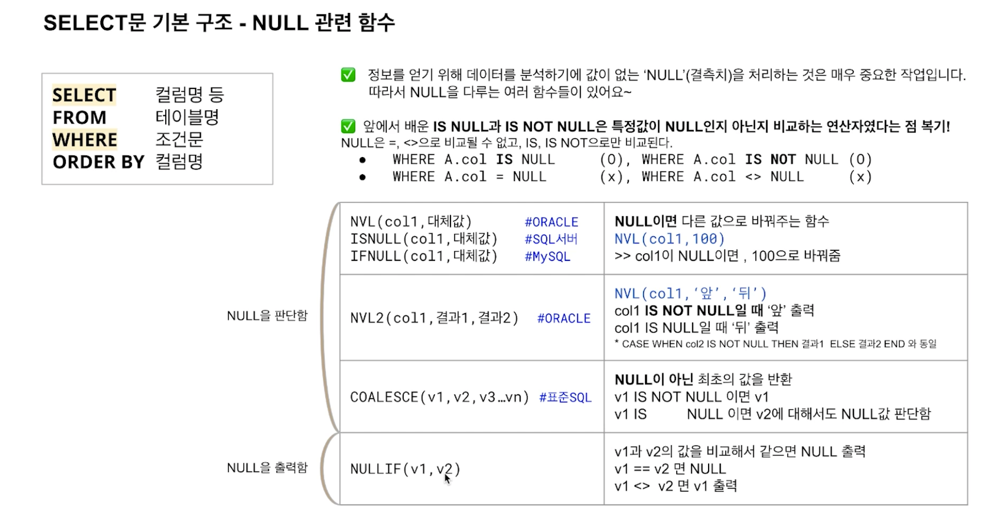
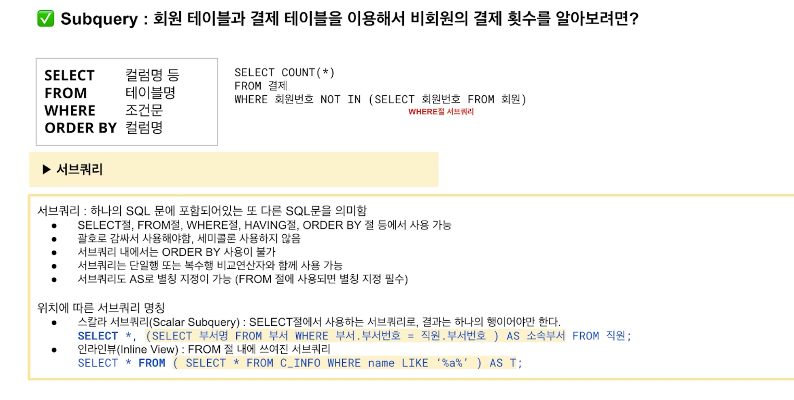
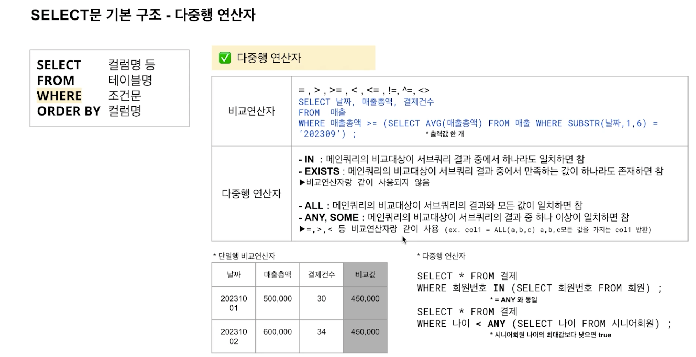
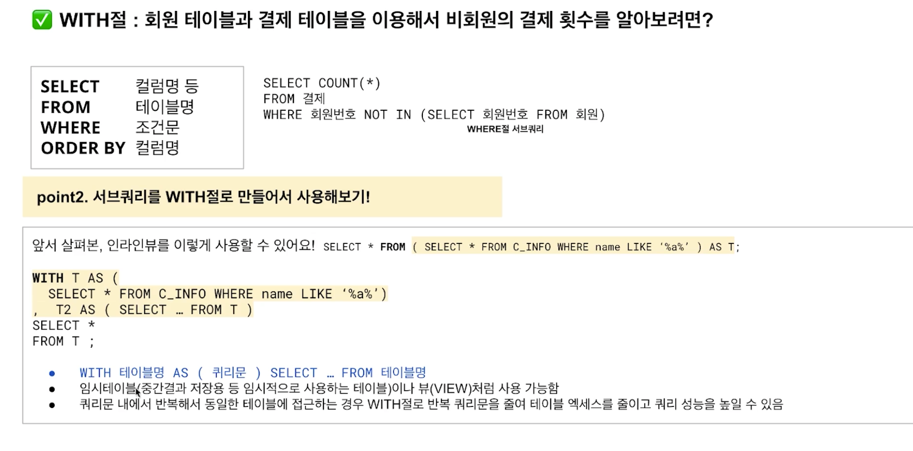
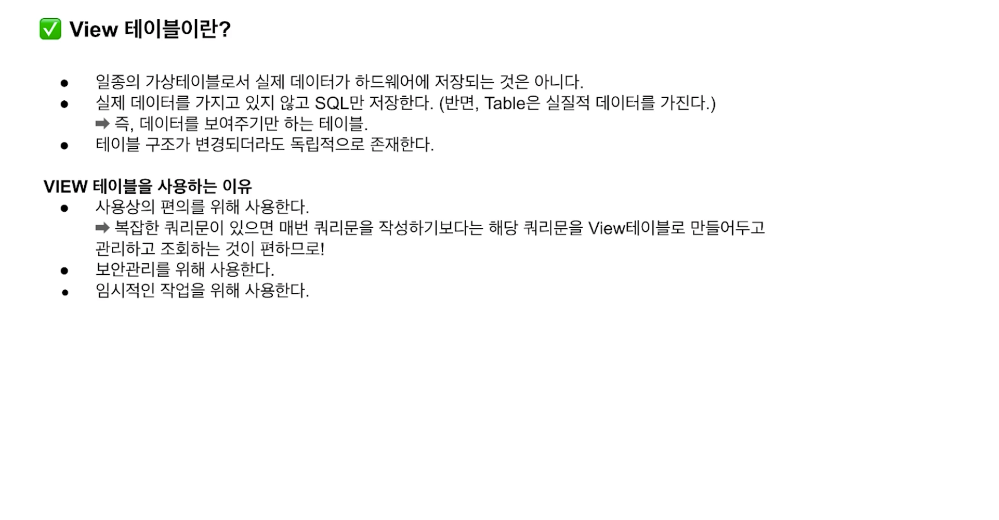
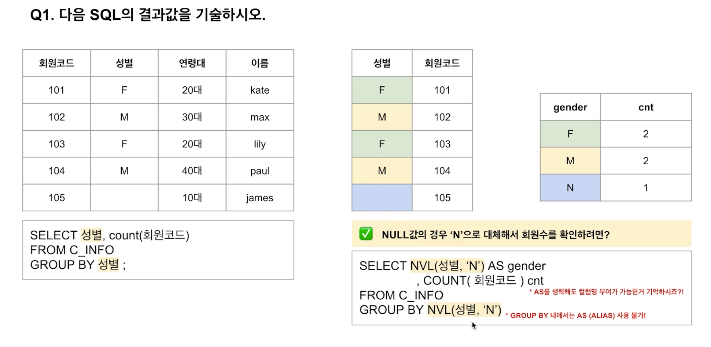
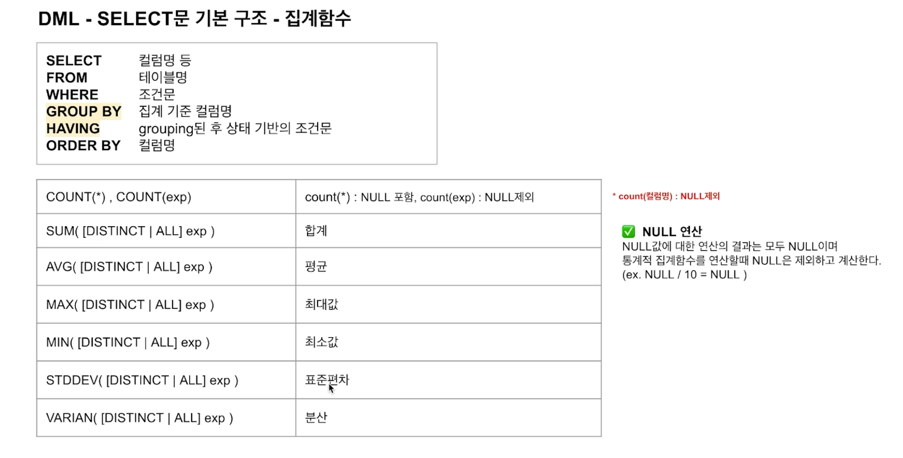
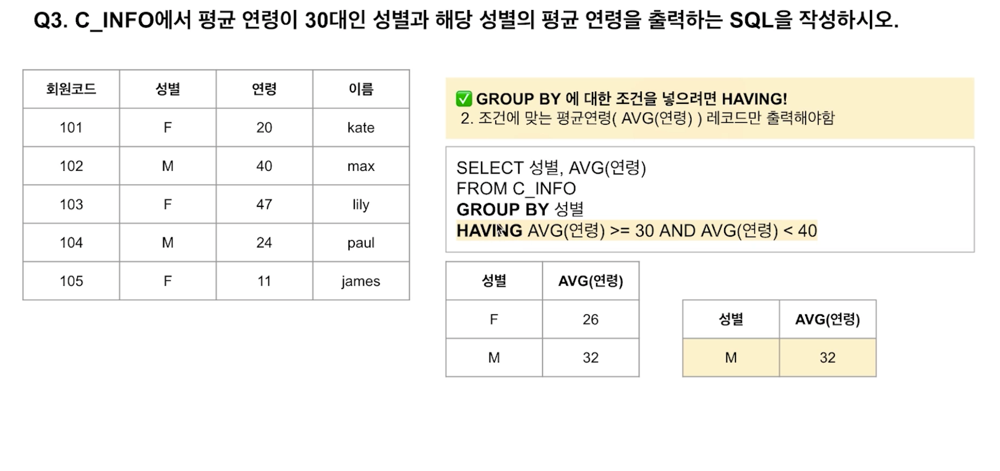

### Where 조건문

```sql
case when col1 < 10 then -- 비교 연산자 (=, <, <=, >, >=)

when col1 between 10 and 99 -- BETWEEN A and B (a와 b 사이에 값이 있는지 판단 : a 이상, b 이하)

when name = 'name' and phone like '%1234' -- 논리연산자 (and, or, not), LIKE %비교문자열%

is null -- null일 경우 true (null은 비교 연산자로는 불가능, 무조건 is로)
is not null -- null 아닐 경우 true
```

### null과 관련한 함수, 연산자 in



nvl, isnull, ifnull의 경우 표현식 2개의 데이터 타입이 같아야 한다.

```sql
in (x, y, z, ...) -- x,y,z 등으로 구성된 목록 값 중 어느 하나라도 일치하면 됨 (or 조건)
not in (x, y, z, ...) -- x,y,z 등으로 구성된 목록 값 중 모두 일치 (and 조건)
```

### 문자열 조건문 연산자

```sql
a like b -- a에 대하여 b와 유사한 문자열 찾아줌
% -- 문자가 해당 위치에 0개 이상 존재한다는 의미
- -- 문자 1개
```

```sql
where name like '%k%' -- name이 k라는 단어를 포함하기만 하면 됨.
where name like 'k%k' -- 양 끝에 k라는 단어가 있는 경우 찾기 위함
where name like 'k_y' -- k와 y 글자 사이에 무조건 1글자 들어가야 함.

-- 주로 날짜 찾을 떄 202309%로 하면, 2023년 9월로 검색하는 개념
```

### 서브쿼리, 다중행 연산자

```sql
select count(*)
from 결제
where 회원번호 not in (select 회원번호 from 회원) -- 회원 테이블에 있는 회원번호가 아닌 회원번호 (즉, 비회원 번호의 결제 횟수)
```



출력되는 행의 개수에 따라, 단일행/다중행 서브쿼리 정의 달라짐.

- 연산이 복잡해도 나오는 결과가 1개면 단일행 서브쿼리
- 연산이 단순해도 결과가 여러 개면 다중행 서브쿼리



서브쿼리에서는 order by 사용 불가능.

### 서브쿼리 응용 - with, view 테이블

임시 테이블을 만들 수 있음.



쿼리문 내에서 동일한 테이블 접근할 경우 with 절을 활용해 쿼리 성능 높일 수 있음.



### group by & having



그룹핑 한 애들을 묶어서 중복 제거함



집계함수들은 null에 대한 연산 결과가 모두 null임.



having은 group by에 대한 조건을 넣을 때 사용함.

### sql 실행 순서

`from => where => group by => having => select => order by`
