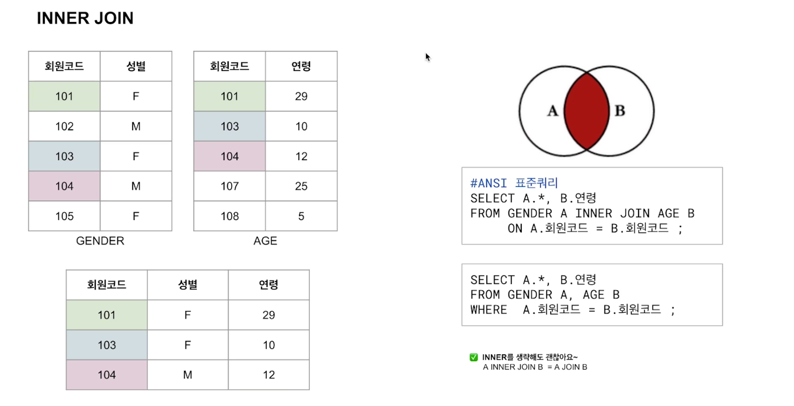

## SQL 활용 1

### JOIN & 표준 JOIN 기초

join은 from 절에 사용됨. (`select - from - join - on -`)

join은 테이블을 결합해줌. (집합과 유사함)

- 교집합 & 합집합
  - inner join
  - left (outer) join
  - right (outer) join
  - (full) outer join
- 합집합
  - union (all)
- 차집합
  - minus (#oracle) = except (#sql server)
- 결합되는 대상 간의 일치 정도
  - EQUI 조인 <> non-EQUI 조인
- 조건구 없는 CROSS JOIN (상호 결합)

### INNER JOIN (where, 3개 이상 join)

#### 일반적인 join. (inner 생략 가능)

- 완전한 교집합 가져올 때 사용함

`select * from a inner join b on a.column = b.column`은 `select * from a, b where a.column = b.column`과 같음.

#### inner join 후에 특정 행만 호출하고 싶을 때?

- from inner join인 경우, where에 추가 (표준쿼리)
- where을 사용한 경우, and로 추가 (oracle)

#### inner join - 3개 이상 테이블 join할 때

- 표준쿼리는 join 2개 사용
- oracle은 from에서 3개 콤마(,)로 연결 후 and로 조건 추가

### LEFT/RIGHT/FULL OUTER JOIN

#### LEFT (OUTER) JOIN

왼쪽 테이블 기준으로 join

#### RIGHT (OUTER) JOIN

오른쪽 테이블 기준으로 join

+가 붙은 테이블의 속성값에 대해 null 허용.

#### (FULL) OUTER JOIN

### UNION (ALL) & JOIN 비교

union은 중복 제거해줌

union all은 중복 제거하지 않음.

join => 관련된 두 테이블에 적어도 하나의 공통 속성이 있을 때 적용할 수 있는 결합 방식 
union => 조회 대상이 되는 컬럼 수가 같고 각 컬럼의 데이터 타입 등 속성이 동일할 때 적용할 수 있는 결합 방식. 레코드 간 중복이 제거된 결과가 반환됨.

### MINUS & (NON) EQUI JOIN & CROSS JOIN

minus를 사용 => 중복된 레코드 제거 한 후 반환. (like UNION)

