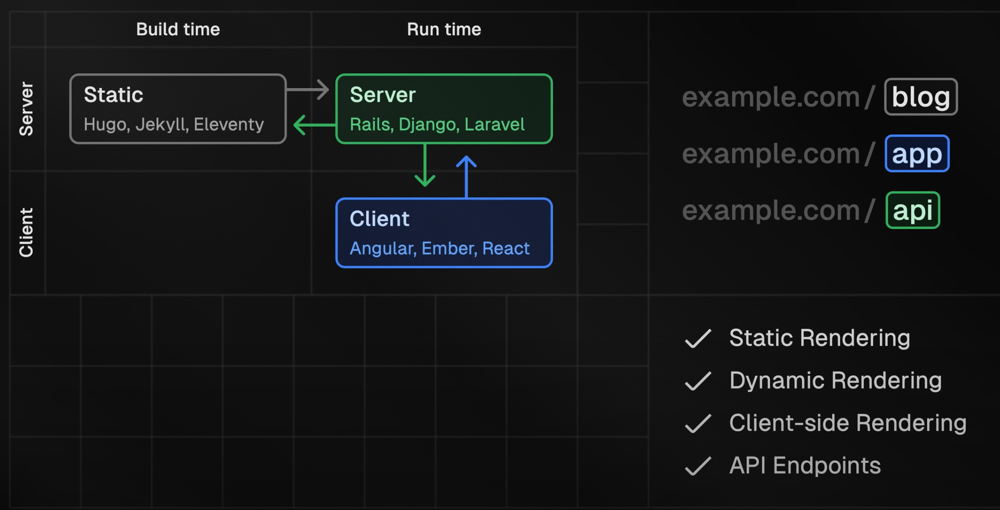
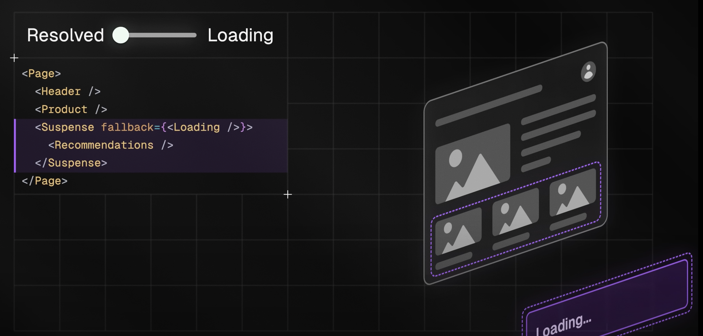

## (PPR) partial prerendering

static, dynamic rendering을 한 페이지에서 다른 api 없이 구현 (next 14에서는 별도 설정 없이도 이를 최적화)<br>

- PPR을 경험해볼 수 있는 웹 : https://www.partialprerendering.com/
- PPR 예제 코드 : https://github.com/vercel-labs/next-partial-prerendering

### dynamic rendering

일반적으로 클라이언트가 요청하고 서버가 페이지를 렌더링하고 응답한다. 매 요청마다 새롭게 렌더링을 한다.<br>
페이지가 실시간 정보 혹은 빈번하게 업데이트되는 데이터에 의존하는 경우 (이커머스), 렌더링은 매번 다른 결과물을 내놓아야 한다.


### static rendering (prerendering)

하지만 대부분의 어플리케이션은 dynamic rendering의 이점을 충분히 누리지 못한다.<br>
이를 위해 존재하는 개념이 static rendering이다.

매 요청마다 동적으로 렌더링을 하는 게 아니라, build time에 미리 렌더링을 해둔다. (pre-rendering)<br>
그리고 pre-rendering한 페이지를 CDN(Content Delivery Network)에 push해둔다.<br>
이후 사용자의 페이지 요청이 올 때마다, 사용자에게 가까운 Edge Region가 Static contents를 전달한다. (not runtime server)


### 지난 렌더링의 패러다임의 문제의식 (ssr, ssg, csr)

하나의 페이지 안에서 ssr, ssg, csr로 구분되는 렌더링 패러다임을 명확히 구분지어서 받아들이기 힘들다.<br>


하나의 팀이 같은 프레임워크, 같은 언어, 같은 라우팅 시스템, 동일한 컴포넌트 구조를 다루면서 렌더링 방식을 다양하게 가져갈 수 있어야 했다.

=> nextjs가 인기를 얻은 이유이기도 하다. (다양한 렌더링 방식을 제공)



### PPR이 등장한 지점

single rendering paradigm의 한계

- static page이더라도 일부분 dynamic rendering이 필요하다. 반대로 dynamic page더라도 일부분에서는 static rendering을 필요로 한다.

우리가 이미 알고 있는 pre-rendering page의 한계

- runtime information에 기반해 pre-rendering할 수 없다는 것
- 그러므로 static하게 pre-rendering을 선택하고 personalizing을 포기하거나 // dynamic하게 rendering을 하거나 둘 중 하나를 선택해야 한다는 것

이 지점에서 PPR(partial pre-rendering)이 등장했다. (한 페이지 안에서 두 렌더링 방식을 허용하는 것)


### PPR은 어떻게 static과 dynamic을 조합하는가 - React의 Boundaries 개념 활용

nextjs는 현재 dynamic api와 관련한 request header를 사용하거나 uncached data request일 경우에만 build time에 pre-rendering을 한다.

- `headers(), cookies(), noStore(), fetch('', { cache : 'no-store' })`
- 이들은 모두 전체 페이지를 dynamic rendering해달라는 일종의 시그널 역할을 한다.

이때 side effect를 막고, 모든 컴포넌트가 그 렌더링 시그널에 영향을 받지 않게끔 한다면이라는 가정에서 PPR이 시작한다.(즉, 시그널이 부모 컴포넌트로 퍼져나가는 걸 막는다면)


#### React는 Boundaries라는 개념을 가지고 있다.

예를 들어, ErrorBoundary는 에러가 페이지 전체에 퍼져나가지 않도록 막는다.


또는 Suspense는 fallback이 페이지 전체에 퍼져나가는 걸 막는다.<br>
(즉, suspense boundary 안에 있는 async operations가 다른 나머지 페이지를 blocking하는 걸 막는다)



#### PPR은 suspense boundaries를 확장한 개념이다.

async code에 더해, runtime dynamic api를 사용하는 컴포넌트를 wrapping한다. (이로써 다른 static prerendering state에게 영향을 주지 않도록 한다.)


### PPR의 전체 시나리오 (PPR과 함께하는 렌더링 과정)

dynamic rendering은 이제 suspense boundaries 안에서만 존재하게 한다.<br>
react는 build time에 가능한 많은 페이지들을 static하게 prerendering한다.<br>
그리고 suspense boundaries 안에 있는 ui들을 렌더링하는 걸 runtime까지 미룬다.


우리의 어플리케이션이 배포되었을 때, partial하게 prerendering된 결과물들이 Edge Network에 push되고, 전체 웹에 퍼져나간다.


runtime에 유저가 page에 방문했을 때, 유저에 가까운 edge 컴퓨터가 static prerendered result를 유저에게 바로 제공한다.


그와 동시에, runtime server에 dynamic rendering이 필요한 부분에 대한 request를 보낸다.


client에서는 이제 prerendered html을 화면에 paint하고, static assets(image, fonts, stylesheets)과 nextjs와 reactjs를 포함하고 있는 javascript bundle을 runtime에 다운로드한다.


다운로드한 컴포넌트들이 interactive한 상태가 되도록 만들어주고(hydrate)<br>
동시에 server는 준비되자마자 runtime informations(request, headers, and cookies)를 사용해서 data를 가져오고 rendering을 하고, chunk들을 클라이언트에게 stream한다.


브라우저는 이에 따라, prerendered fallbacks를 fresh dynamic content로 대체한다.


### PPR이 뭐가 다르냐면 - 브라우저에게 hint를 줘서 최적화를 꾀한다.

#### general dynamic rendering

일반적으로 dynamic rendering을 할 때, 클라이언트에서 initial request를 전송하는 시간과 서버가 받은 response를 계산하는 시간에는 일정한 텀이 존재한다. 이 텀은 rendering server가 크고, uncached data request가 느리고, streaming도 전혀 사용되지 않을 수록 혹은 serverless environments에서 더욱 길어진다.


게다가 클라이언트가 응답을 받기까지, 유저(혹은 크롤러)는 어떠한 meaningful한 것도 보지 못하게 된다.<br>
브라우저는 어떠한 것도 할 수 없는 멍청한 상태가 되는 것이다.

#### general static rendering

static rendering은 runtime computation이 없으므로 이 구간이 짧고, response 또한 edge로부터 전달 받는다.


#### partial pre-rendering

ppr은 static rendering의 이점을 지닌다.<br>
클라이언트에게 edge로부터 받은 fast intial response를 전달하는데, 이 데이터는 significant headstart 지점 역할을 한다.<br>
이로써 브라우저는 멍청하게 가만히 있지 않고 server가 dynamic response를 처리하는 동안 일을 할 수 있게 된다.


### PPR은 더 나아간다 - 여지를 남겨둬서 렌더링 아키텍쳐가 유연함을 갖게 하는 방법

위와 같은 방식으로 PPR은 최적화 여지를 남겨둔다.

PPR을 사용하면, static rendering과 dynamic rendering이라는 두 렌더링 모델의 tools를 전부 활용할 수 있게 된다.

예를 들어 static parts에서는,

middleware를 사용해서 prerendered shells를 다양한 조건에 따라 rewrite할 수 있다.


또한 외부에서 받을 수 있는 static contents(file system, database, api, cms)를 fetching할 수 있다.

또한 prerendered 부분들을 주기적으로 혹은 external data changes에 반응해서 ISR(Incremental static regeneration)까지.


dynamic parts에서는 data requests를 cache하고, 렌더링에 필요한 chunk들을 더 작게 streaming할 수 있고.


심지어 완전 dynamic하게 가서 하나의 body 태그를 갖게 되더라도, PPR에서는 어떤 번들과 assets가 필요한지 힌트를 부여함으로써 브라우저가 멍청하지 않도록 유지한다.


반대로 완전히 static하게 하더라도, dynamicity를 남겨둔다.

### 덧붙이기

PPR을 정리하자면, PPR은 모든 페이지를 build time에 rendering한다. 단, Suspense로 wrapping된 exception을 둔다.<br>

```
PPR lets you render the entire page at build time, with the exception of Suspense wrapped components (likely other exceptions, but specific to this question that's the difference).

With streaming/suspense, you render the entire page on request. Suspense lets you fetch data in parallel, and streaming lets you replace the suspense component with the fully rendered bits as each of them finish. But everything is done on request time.

With PPR, you render part of the page at build time and part of it at request. Anything that can be rendered at build time, is rendered at build time. Everything else should be wrapped in Suspense (with a fallback to prevent jarring CSS behavior).

So instead of needing to render the entire page (the current setup) or generate the entire page at build time (static pages), you can generate a "partial first page" at build time and render out the parts that are dynamic while the server sends that static page. Everything about the app that doesn't change gets to the user fast.

This effectively gets the first paint more quickly, which feels faster even if the actual/real improvements in speed are negligible in some particular app. The user who sees things happening in 100ms increments is usually happier than the one waiting 700ms for something to happen, even if they both waited a total of 700ms.
```

PPR은 아주 최소한의 bundle과 static assets라도 브라우저에게 전달함으로써 최적화를 꾀한다.

PPR은 static, dynamic 두 모델을 유연하게 사용하게끔 한다.

하나의 페이지 안에서 렌더링을 쪼개는 접근 방법은 nextjs만 제공하는 건 아니다. [island-architecture](https://patterns-dev-kr.github.io/rendering-patterns/the-island-architecture/)<br> 같은 것만 봐도 렌더링 방식을 쪼개는 접근 방법은 다양하게 존재해왔으나, 이를 선언적으로, 개발자가 편하게 쓸 수 있게 환경을 제공해준다는 점에서 nextjs가 강점을 갖고 있다.

## 참고자료

[Next.js Explained: Partial Prerendering (What? Why? How?)](https://www.youtube.com/watch?v=MTcPrTIBkpA)<br>
[Partial prerendering: Building towards a new default rendering model for web applications](https://vercel.com/blog/partial-prerendering-with-next-js-creating-a-new-default-rendering-model)<br>
[Partial Prerendering in Next.js 14 (Preview)](https://www.youtube.com/watch?v=wv7w_Zx-FMU)<br>
[A guide to enabling partial pre-rendering in Next.js](https://blog.logrocket.com/guide-enabling-partial-pre-rendering-next-js/)<br>
[Product and Platform Engineers](https://leerob.io/blog/product-engineers)<br>
[vercel-labs/next-partial-prerendering](https://github.com/vercel-labs/next-partial-prerendering)<br>
[Partial prerendering: Building towards a new default rendering model for web applications](https://vercel.com/blog/partial-prerendering-with-next-js-creating-a-new-default-rendering-model)<br>

[Difference between partial rendering(PPR) and the current streaming suspense? #58322](https://github.com/vercel/next.js/discussions/58322)<br>
