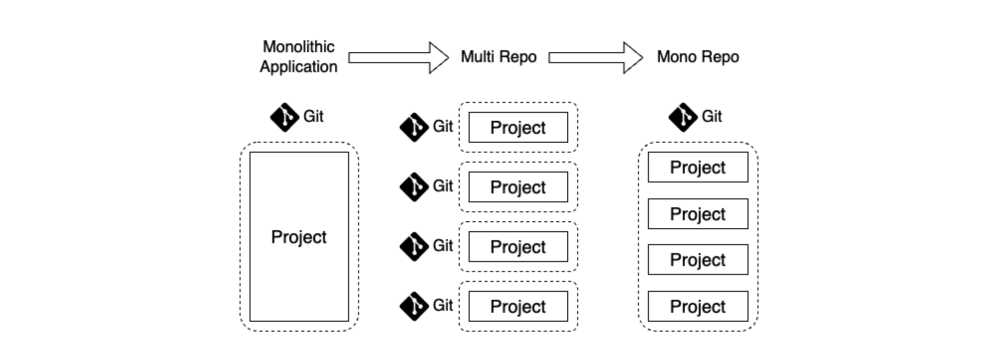
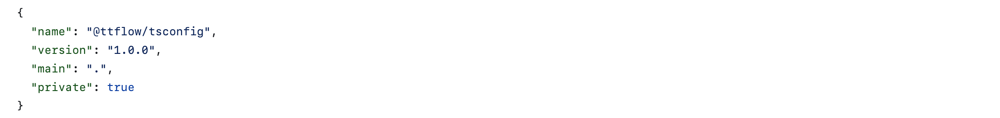

# 모노레포 기초

모노레포란, 2개 이상의 프로젝트 코드를 동일한 저장소에서 관리하는 소프트웨어 개발 전략이다. 

## 모노레포 개념

### 모노레포를 이해하려면, 소프트웨어 개발 방식의 역사부터 시작하자 : 모놀리식의 단점

프로젝트 규모가 커질수록, 모놀리식 어플리케이션(Monolithic Application)의 한계가 명확해진다. 
코드들이 모듈화없이 단 하나의 버전으로 관리되므로, 관심사 분리, 설계, 리팩토링, 배포 등의 작업이 매번 비대해진다.

모놀리식의 한계를 해결하기 위해 어플리케이션을 모듈화(Modularity)할 수 있다. 
모듈화한 어플리케이션들을 다른 어플리케이션에 쉽게 적용하기 위해 독자적인 저장소로 분리해 관리할 수 있다. 
이러한 구조를 멀티레포(Multirepo, 혹은 Polyrepo)라고 한다.

거대한 어플리케이션을 모듈화했으니 문제가 해결되길 바라지만, 또 다른 문제가 있다.

### 멀티레포의 단점

별도의 저장소로 모듈들을 관리하다 보면, 다음과 같은 문제가 발생한다.

매번 번거로운 프로젝트 초기 설정으로 인한

1. 패키지 간 매번 초기 세팅이 필요하며, 이로 인한 코드 중복 발생 (`저장소 생성 > 개발 환경 구축 > 패키지 배포`)
2. 모듈화된 저장소가 늘어날수록 관리 포인트도 비례해서 증가
3. 모듈 저장소의 자율성과 독립성이 높아, 전체 프로젝트의 일관성 저하 (모듈 저장소마다 컨벤션, 기술 스택이 천차만별일 수 있다.)

### 모노레포의 필요성, 장점

모노레포를 사용하면, 패키지를 배포할 필요도 없다. 
초기 개발 환경 구축을 공유할 수 있으며, 프로젝트의 일관성을 확보할 수 있다.

[모던 프론트엔드 프로젝트 구성 기법 - 모노레포 개념 편](https://d2.naver.com/helloworld/0923884)에서는 다음과 같은 용이성을 제시한다.

#### 관리측면

- 코드 공유: 서로 다른 프로젝트 간에 쉽게 소스 코드를 공유
- 일관성 있는 도구: 서로 다른 프로젝트들(심지어 서로 다른 프레임워크를 사용하더라도)에서 일관된 개발 경험을 제공
- 스케폴딩: 새로운 프로젝트를 생성할 때 초기 코드를 쉽게 생성
- 프로젝트 제약 및 가시성(visibility): 저장소 내에서 의존 관계를 제한하는 규칙 정의 지원. 예를 들어, 일부 프로젝트를 팀 전용으로 표시하거나 특정 프레임워크을 사용 중임을 기술.

#### 속도 측면

- 로컬 캐싱: 같은 머신에서 같은 것을 두 번 빌드하거나 테스트하지 않음
- 분산 캐싱: 다양한 환경에서 캐시 아티팩트를 공유. 즉, 조직 단위로 여러 CI 환경에 걸쳐 같은 것을 두 번 빌드, 테스트하지 않음
- 로컬 작업 오케스트레이션: 빌드 및 테스트 등의 작업을 순서에 맞게 병렬로 실행
- 분산 작업 실행: 단일 시스템에서 실행되어 여러 시스템에 명령을 전달
- 변화에 영향을 받는 프로젝트 감지: 변경의 영향을 받을 수 있는 항목을 결정하여 영향을 받는 프로젝트만 빌드/테스트

#### 구조 파악 측면

- 워크스페이스 분석: 추가 구성 없이 주어진 워크 스페이스의 의존성 관계를 분석
- 의존성 그래프 시각화: 프로젝트 및 작업 간의 종속 관계를 시각화

### 당연히 모노레포가 정답은 아니다.

모놀리식 어플리케이션의 경우, 빠르게 개발할 수 있으므로 장점이 존재한다. 
멀티레포도 모듈화를 통한 관심사 분리와, 개별 모듈에 대한 개발 분리가 필요할 때 적절하다. 

모노레포라고 장점만 있을까? 
아무런 고려 없이 개발하면 CI 속도만 불필요하게 늘어날 수도 있다.

## 모노레포 구축해보기

[example code of monorepo with pnpm workspace](https://github.com/Things-That-Flow/things-that-flow/releases/tag/v0.0.1) 

모노레포를 직접 구축해보자는 계기는 다음과 같다.

- 현재 회사에서 Nx 프레임워크의 디렉토리 구조를 차용해서 사용하고 있다.
- 아무리 개념을 읽어도 직접 구축해봐야 더 깊게 이해할 수 있으니까!

패키지 매니저마다 workspace를 구축할 수 있는 설정들이 존재한다. 
패키지 매니저의 workspace를 쓰지 않고 프레임워크를 쓸 수도 있다. 훨씬 편하고 효율적이다.

pnpm의 경우, 
pnpm-workspace.yaml 파일에 워크스페이스로 사용할 디렉토리를 작성하면 된다. 
package.json의 workspaces 안에 작성해두면 패키지를 가져올 때 `workspace:*`를 사용할 수 있다.

`workspace:*`라고 명시하지 않고 직접적인 버전을 명시해도 된다. `workspace:^1.0.0`

패키지를 배포하지 않아도, 위와 같이 package.json의 name으로 패키지를 가져올 수 있다. 
예를 들어, @ttflow/tsconfig는 아래와 같이 작성되어 있다.

## 참고자료

아래 자료들을 참고해 개념을 정리했고, [pnpm workspapce](https://pnpm.io/workspaces)를 사용해 코드를 작성했습니다.

[[ETC] Monorepo - 개념](https://beomy.github.io/tech/etc/monorepo-concept/) 
[모던 프론트엔드 프로젝트 구성 기법 - 모노레포 개념 편](https://d2.naver.com/helloworld/0923884) 
[모노레포 이렇게 좋은데 왜 안써요?](https://medium.com/musinsa-tech/journey-of-a-frontend-monorepo-8f5480b80661) 
[팀워크 향상을 위한 모노레포(Monorepo) 시스템 구축](https://blog.mathpresso.com/%ED%8C%80%EC%9B%8C%ED%81%AC-%ED%96%A5%EC%83%81%EC%9D%84-%EC%9C%84%ED%95%9C-%EB%AA%A8%EB%85%B8%EB%A0%88%ED%8F%AC-monorepo-%EC%8B%9C%EC%8A%A4%ED%85%9C-%EA%B5%AC%EC%B6%95-3ae1b0112f1b) 
