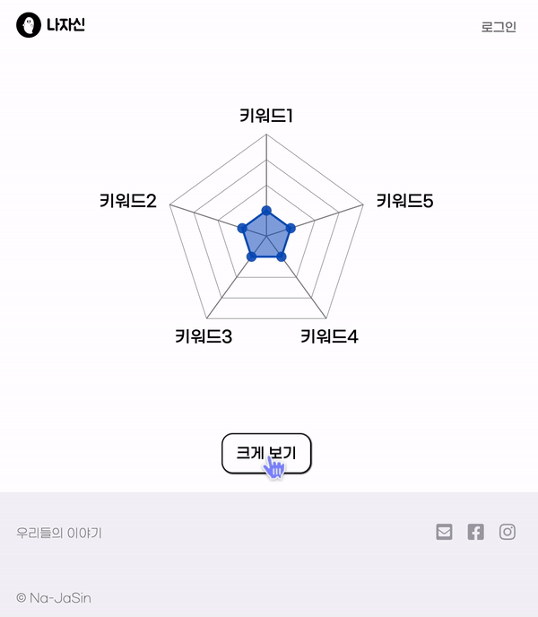
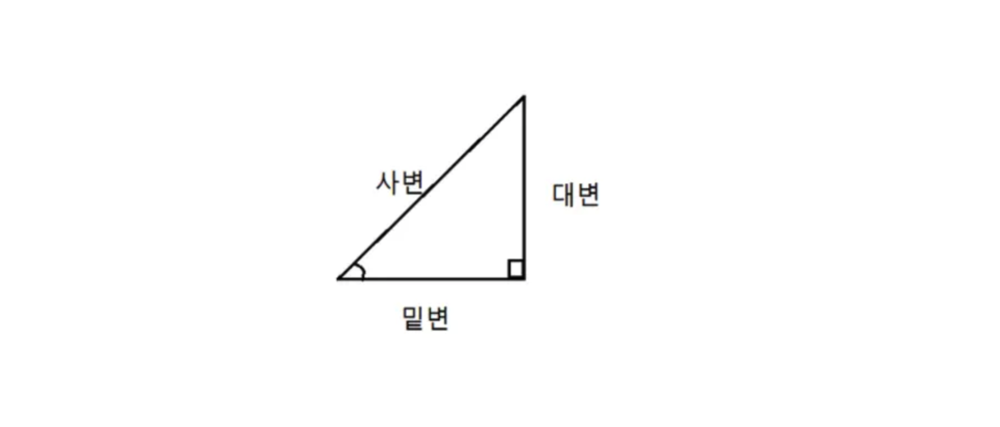

프로젝트에서 데이터 입출력이 가능한 방사형 그래프를 만든 적이 있었다.



그래프를 그리기 위해 알아야 하는 최소한의 수학

삼각함수를 아주 조금 알면 좋다.

그 중에서도 cos, sin에 대한 수학적인 계산은 메서드로 제공되므로(Math.sin(), Math.cos()),

반지름을 알면 특정 좌표(y,x)를 알 수 있다는 사실만 알면 된다.

삼각함수는 원래 원 안에 있는 직각삼각형의 각변의 길이 비율을 다루기 때문에, 직각을 제외한 각도(중심각)에 따라 변하는 길이의 관계를 쉽게 알 수 있다.

- Math.sin은 한 각에 대한 사인값을 반환한다. 1에서 -1 사이의 값이다.
- Math.cos는 라디언의 코사인값을 반환한다. 마찬가지로 1에서 -1 사이의 값이다.



사인값은 대변 길이 / 사변 길이, 코사인값은 밑변 길이 / 사변 길이

이 사변의 길이라는 게 좌표에서는 원의 반지름이 된다.

생각해보면, 이 반지름은 보통 그림을 그릴 때 내가 설정할 수 있기 때문에 쉽다.

삼각함수는 매개변수와 반환값 모두 호도법(라디안)을 사용한다.

라디안이란? 각의 크기를 재는 SI 단위입니다. 1라디안은 약 57.3도이다. 라디안 값을 각도 값으로 반환하면, 라디안 / (Math.PI / 180) = 각도값이 된다.

그래서, 코드에서도 각도값으로 반환하기 위해 cfg.radians(2 \* Math.PI)를 사용했었다.

그리고 모든 각도 값이 필요한 게 아니라 각 level 단위로만 필요하기 때문에 total로만 나눠주고 있다.

```js
const cfg = {
  radius: 5,
  w: radarWidth,
  h: radarHeight,
  factor: 1,
  factorLegend: 0.85,
  levels: 4,
  maxValue: 100,
  radians: 2 * Math.PI,
  opacityArea: 0.5,
  color: d3.scale.category10(),
};

const allAxis = data.map((i) => i.axis);
const total = allAxis.length;
const radius = cfg.factor * Math.min(cfg.w / 2, cfg.h / 2);
```

좌표에 대한 아주 기본적인 지식만을 가지고 데이터 초기값을 설정한 뒤, 본격적으로 d3를 사용해서 그래프를 그려주면 된다.

### d3를 사용해서 그래프 그리기

#### 초기 설정

먼저 처음에는 그래프를 초기화해주는 코드를 삽입해줘야 한다. 기존 데이터에 쌓이지 않고 초기화해야 매번 새로운 그래프를 그릴 수 있기 때문이다.

```js
d3.select(elementId).select("svg").remove();

const svg = d3
  .select(elementId)
  .append("svg")
  .attr("width", cfg.w + radarPadding)
  .attr("height", cfg.h + radarPadding)
  .append("g")
  .attr("transform", `translate(${radarPadding / 2}, ${radarPadding / 2})`);
```

d3에서는 attr, append, select 등 svg와 관련된 태그들이나 속성을 쉽게 넣을 수 있는 메서드들이 잘 되어 있어서 편리하다.

그리고 나서 그래프를 그리는 함수들을 정의하고 언제 실행할지를 결정하는 변수를 통해 그래프를 선택적으로 그릴 수 있는 환경을 만들어준다.

```js
// isDefault일 때는 polygon만 그리며, drag 핸들러를 동작시키지 않는다.
!isDefault && drawFrame();
const maxAxisValues: Array<{ x: number, y: number }> = [];
!isDefault && drawAxis();
const dataValues: Array<[number, number]> = [];
reCalculatePoints();

const areagg = initPolygon();
isViewPolygon && drawPoly(); // draw 가능 여부
```

예를 들어 내가 그리려는 방사형 그래프의 경우, 하나의 프레임 안에 여러 개의 Polygon이 들어갈 수 있는 형태이어야 했다. 그러므로 isDefault라는 변수를 통해 프레임을 그릴 건지를 선택해주는 로직을 추가해줬다.

어쨌든, 방사형 그래프를 그리기 위해 필요한 건 다음의 함수들이다.

- drawFrame : 프레임을 그리는 함수
- drawAxis : 축을 그리는 함수
- initPolygon : 처음 보여줄 polygon을 생성하는 함수
- drawNode : 5개의 노드를 그리는 함수
- move : 내부에서 reCalculatePoints와 drawPoly를 사용해서 내부에 채워지는 영역을 그리는 함수

#### 메인 로직

아래는 drawNode 함수인데, 이 함수의 경우 노드를 유저가 입력할 때마다 Polygon을 다시 그려야 하므로 아래와 같이 코드가 길어지긴 한다.

d3에서는 on 메서드를 통해 이벤트를 다룰 수 있으며, 각각의 이벤트마다 함수를 연결해주었다.

dragstart 이벤트 발생 시 스크롤을 막아줌으로써 모바일에서 터치 이벤트와 스크롤 이벤트가 충돌되지 않도록 처리해주었다.

```js
function drawNode() {
    svg
      .selectAll(".nodes")
      .data(data)
      .enter()
      .append("circle")
      .attr("class", radarClassName)
      .attr("r", cfg.radius)
      .attr("alt", (j) => Math.max(j.value, 0))
      .attr(
        "cx",
        (j, i) =>
          (cfg.w / 2) *
          (1 -
            (Math.max(j.value, 0) / cfg.maxValue) *
              cfg.factor *
              Math.sin((i * cfg.radians) / total))
      )
      .attr(
        "cy",
        (j, i) =>
          (cfg.h / 2) *
          (1 -
            (Math.max(j.value, 0) / cfg.maxValue) *
              cfg.factor *
              Math.cos((i * cfg.radians) / total))
      )
      .attr("data-id", (j) => j.axis)
      .style("fill", radarColor)
      .style("fill-opacity", 0.9)
      .on("mouseover", function (this: any, d) {
        d3.select(this).style("cursor", "pointer");

        const newX = parseFloat(d3.select(this).attr("cx")) - 10;
        const newY = parseFloat(d3.select(this).attr("cy")) - 5;
        tooltip
          .attr("x", newX)
          .attr("y", newY)
          .attr(
            "transform",
            `rotate(${
              (-cfg.radians / total) * d.order * (180 / Math.PI)
            }, ${newX}, ${newY})`
          ) // 툴팁 텍스트 반대 회전
          .text(d.value >> 0)
          .transition("200")
          .style("opacity", 1);
        const z = `polygon.${d3.select(this).attr("class")}`;
        svg.selectAll("polygon").transition("200").style("fill-opacity", 0.1);
        svg.selectAll(z).transition("200").style("fill-opacity", 0.7);
      })
      .on("mouseout", () => {
        tooltip.transition("200").style("opacity", 0);
        svg
          .selectAll("polygon")
          .transition("200")
          .style("fill-opacity", cfg.opacityArea);
      })
      .call(
        d3.behavior
          .drag<DataPoint>()
          .on("dragstart", disableScroll)
          .on("drag", move)
          .on("dragend", moveEnd)
      ) // 드래그 시 move 함수 실행, 드래그 끝났을 때 moveEnd 함수 실행
      .append("title")
      .text((j) => Math.max(j.value, 0));
  }
```

dragend 이벤트가 실행되었을 때, 아래 moveEnd 함수가 실행된다.

드래그 중에도 유저에게 데이터 변동 사항을 보여줄 수 있어야 하며, 드래그가 끝났을 때 데이터를 서버로 전송해야 한다. 이때 prop으로 전달받은 onDragOutUserInput이라는 함수를 통해 변경된 데이터를 React의 State로 관리할 수 있는 코드를 삽입해주었다.

```js
function moveEnd() {
  if (isDragging) {
    isDragging = false;
    enableScroll(); // 드래그 끝났을 때 스크롤 다시 활성화
  }

  // 유저가 변경한 데이터 불변성 유지
  const changedData = data.map(({ axis, value, order }) => ({
    axis,
    value: value >> 0,
    order,
  }));
  onDragOutUserInput(changedData);
}
```

드래그 중일 때는 위치를 계산해야 하며, 중요했던 점은 0 이하로 값이 떨어지지 않도록 하는 것이다.

```js
function move(this: any, dobj: DataPoint, i: number) {
	if (!isDragging) {
		isDragging = true;
		disableScroll(); // 드래그 중에 스크롤 막기
	}

	const event = d3.event as d3.DragEvent;

	this.parentNode.appendChild(this);
	const dragTarget = d3.select(this);

	const oldData = dragTarget.data()[0];
	const oldX = parseFloat(dragTarget.attr("cx")) - cfg.w / 2;
	const oldY = cfg.h / 2 - parseFloat(dragTarget.attr("cy"));
	let newY = 0;
	let newX = 0;
	let newValue = 0;

	const maxX = maxAxisValues[i].x - cfg.w / 2;
	const maxY = cfg.h / 2 - maxAxisValues[i].y;

	if (oldX === 0) {
		newY = oldY - event.dy;
		if (Math.abs(newY) > Math.abs(maxY)) {
			newY = maxY;
		}
		newValue = (newY / oldY) * oldData.value;
	} else {
		const slope = oldY / oldX;
		newX = event.dx + parseFloat(dragTarget.attr("cx")) - cfg.w / 2;
		if (Math.abs(newX) > Math.abs(maxX)) {
			newX = maxX;
		}
		newY = newX * slope;

		const ratio = newX / oldX;
		newValue = ratio * oldData.value;
	}

	// 0보다 작아졌을 때 멈춘다.
	if (newValue <= 25) {
		return;
	}

	dragTarget
		.attr("cx", () => newX + cfg.w / 2)
		.attr("cy", () => cfg.h / 2 - newY);
	data[oldData.order].value = newValue;

	reCalculatePoints();
	drawPoly();
}
```

#### 전체 코드

[https://github.com/wooleejaan/react-playground/tree/main/src/\_depracated/RadarPage](https://github.com/wooleejaan/react-playground/tree/main/src/_depracated/RadarPage)
