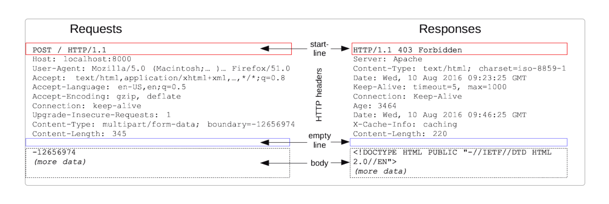
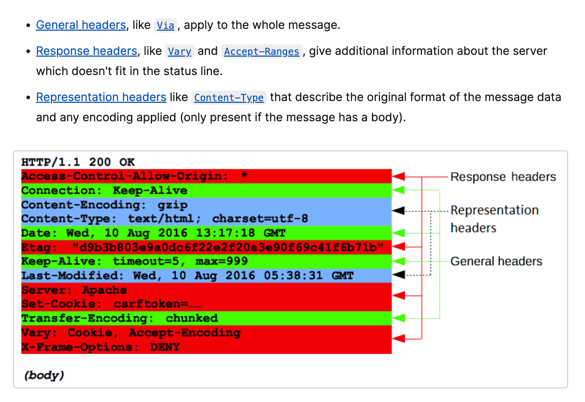

문서 내욘은 주로 http/1.1 기준

## http message header

http 통신 시, request, response에는 반드시 message header가 포함됨.

### request http message

method, uri, http version, http header field 등으로 구성됨.



message header에는 리퀘스트 라인, 리퀘스트 헤더 필드, 일반 헤더 필드, 엔티티 헤더 필드 등으로 구성됨.

- `리퀘스트 라인`에 method, uri, http 버전 등이 명시되어 있고,
- `리퀘스트 헤더 필드 ~ 엔티티 헤더 필드`를 `http 헤더 필드`라고 함.

### response http message



마찬가지로 message header에 상태라인, 리퀘스트 헤더 필드, 일반 헤더 필드, 엔티티 헤더 필드 등으로 구성됨.

- `상태 라인`에 http 버전, 상태 코드 등이 명시되어 있고,
- `리퀘스트 헤더 필드 ~ 엔티티 헤더 필드`를 `http 헤더 필드`라고 함.

## http header field

http header 필드 => message body 크기, 사용하고 있는 언어, 인증 정보 등 제공하기 위함

http header field는 `헤드 필드 명 : 필드 값`으로 구성. (ex, `Content-Type:text/html`)

헤더 필드 중복되면 브라우저 사양에 따라 다르게 처리? (최초 헤더 필드를 우선 처리 혹은 마지막 헤더 필드 우선 처리)

### http header field 4종류

1. 일반적인 헤더 필드 general header fields

request, response 둘 다 사용

2. 리퀘스트 헤더 필드 request header fields
3. 리스폰스 헤더 필드 response header fields
4. 엔티티 헤더 필드 entity header fields

reqeust, response message에 포함된 entity에 사용되는 header : 콘텐츠 갱신 시간 등 엔티티에 관한 부가 정보 명시.

### http/1.1 header field는 47종류

request header fields

- Cache-Control : 캐싱 동작 지정
- Connection : Hop-by-hop 헤더, 커넥션 관리
- Pragma : 메시지 제어

http/1.1보다 오래된 버전의 흔적임. http/1.0과 후방 호환성을 위해서만 존재하는 헤더 필드.<br>
모든 중간서버가 http/1.1 기준이면 Cache-Ctonrol:no-cache를 사용하는 게 바람직하지만, 버전을 전부 파악하기 어려우므로 그냥 아래와 같이 작성함

```
Cache-Control: no-cache
Pragma: no-cache
```

- Trailer : 메시지의 끝에 있는 헤더의 일람 (메시지 바디 뒤에 기술되어 있는 헤더 필드 미리 전달. http/1.1의 청크 저송 인코딩 사용하고 있을 때만 가능)
- Transfer-Encoding : 메시지 바디의 전송 코딩 형식 지정 (ex, `Transfer-Encoding: chunked`라고 명시해서 청크 전송 코딩 유효 상태 명시)
- Via : 프록시 서버에 관한 정보 (프록시나 게이트웨이가 자신의 서버 정보를 명시)
- Accept : 유저 에이전트가 처리 가능한 미디어 타입
- Authorization : 웹 인증 정보
- Expect : 서버에 대한 특정 동작 기대
- lf-Match : 엔티티 태그 비교
- lf-Modified-Since : 리소스 갱신 시간 비교
- lf-None-Match : 엔티티 태그 비교 (lf-Match의 반대)
- lf-Range : 리소스 갱신되지 않은 경우, 엔티티의 바이트 범위 요구를 송신
- lf-Unmodified-Since : 리소스 갱신 시간 비교 (lf-Modified-Since의 반대)
- Max-Forwards : 최대 전송 홉 수
- Proxy-Authorization : 프록시 서버의 클라이언트 인증 정보
- ...

response header fields

- Age : 리소스 지정 경과 시간
- Etag : 리소스 특정하기 위한 정보
- Location : 클라이언트를 지정한 URI에 redirect
- Proxy-Authenticate : 프록시 서버의 클라이언트 인증을 위한 정보
- Retry-After : request 재시행의 타이밍 요구
- Vary : 프록시 서버에 대한 캐시 관리 정보
- WWW-Authenticate : 서버의 클라이언트 인증 정보
- ...

entity header fields

- Content-Type : 엔티티 바디의 미디어 타입
- Expires : 엔티티 바디의 유효기간 날짜
- Last-Modified : 리소스의 최종 갱신 날짜
- ...

### http/1.1 이외 header fields

RFC2616에 정의된 47종류만 있는 것 아님.

비표준 헤더 필드는 RFC4229 HTTP Header Field Registrations에 정리되어 있음.

### End-to-end header와 Hop-by-hop header

http header field는 `캐시`와 `비 캐시 프록시` 동작을 정의하기 위해 2개 카테고리 분류

End-to-end header : 이 카테고리 분류된 헤더는 request, response 최종 수신자에게 전달. 캐시에서 구축된 response 중 보존되어야 하고, 다시 전송하지 않으면 안 되도록 정의

Hop-by-hop header : 이 카테고리 분류된 헤더는 1번 전송에 대해서만 유효하고 캐시와 프록시에 의해 전송되지 않은 것도 있음. HTTP/1.1과 그 이후 사용되는 Hop-by-hop header는 Connection 헤더 필드에 열거해야 함.

아래 Hop-by-hop 이외에는 End-to-end라고 생각하면 됨.

- Connection, Keep-Alive, Proxy-Authenticate, Proxy-Authorization, Trailer, TE, Transfer-Encoding, Upgrade

### 헤더 필드 상세 - Cache-Control

여러 개의 명령 디렉티브를 콤마(,)로 구분해서 명시함.

request 디렉티브 목록 : no-cache, no-store, max-age, max-state, min-fresh, no-transform, only-if-cached, cache-extension<br>
response 디렉티브 목록 : public, private, no-cache, no-store, no-transform, must-revalidate, proxy-revalidate, max-age, s-maxage, cache-extension

캐시 가능 여부 나타내는 디렉티브

- public : 다른 유저에게도 돌려줄 수 있는 캐시해도 좋음
- private : response가 특정 유저 대상으로만 리소스 캐시, 다른 유저로부터 같은 request 오더라도 캐시 반환 안함.
- no-cache :
  - 클라이언트 request로 사용된 경우 캐시된 response를 클라이언트가 거부함. (즉, 중간 캐시 서버가 origin server까지 request 전송해야 함)
  - 서버 reponse에 사용된 경우 캐시 서버가 리소스 저장x.
  - `Cache-Control : no-cache=Location` : 서버 response로 헤더필드명이 명시된 경우, 이 지정된 헤더 필드만 캐시x (서버 response에서만 사용 가능)

캐시 보존 가능한 것을 제어하는 디렉티브

- no-store : request, response에 기밀 정보 포함되어 있음을 나타냄. => request, response 일부를 로컬 스토리지에 저장해서는 안 된다고 명시.

캐시 기한이나 검증을 지정하는 디렉티브

- s-maxage : (ex, `Cache-Control: s-maxage=604800`) max-age와 동일한데, 여러 유저가 이용할 수 있는 공유 캐시 서버에서만 적용됨. (즉, 같은 유저에 반복해서 response 반환하는 캐시 서버는 무효한 디렉티브임) => s-maxage 사용한 경우, Expires 헤더 필드와 max-age 디렉티브는 무시됨.
- max-age : (ex, `Cache-Control: max-age=604800`)
  - 클라이언트에서 max-age 디렉티브 쓴 경우 : 캐시되었던 리소스 받아들임. 지정한 값이 0이면 캐시 서버는 request를 항상 origin 서버에 넘겨야 함.
  - 서버에서 쓴 경우 : 캐시 서버가 유효성의 재확인 하지 않고, 리소스를 캐시에 보존해두는 최대 시간을 나타냄.
  - HTTP/1.1 캐시 서버는 Expires 헤더 필드와 max-age 디렉티브 둘 다 쓴 경우 max-age 디렉티브 우선함. (HTTP/1.0 캐시 서버는 반대로 max-age 디렉티브를 무시함)
- min-fresh : 캐시된 리소스가 적어도 지정된 시간 동안은 최신 상태 반환하도록 캐시 서버에 요구. (60초라고 하면, 60초 이내 유효기간 끝나는 리소스를 반환하면 안 됨)

- max-stale : (ex, `Cache-Control: max-stale=3600`)
  - 캐시된 리소스의 유효기간이 끝나도 받아들일 수 있음을 나타냄. 이게 지정 안 되어 있으면 클라이언트는 캐시 유효기간 지나도 받아들임. (3600이면, 유효기간 지나고 나서 3600초 이내면 받아들인다는 의미)
- only-if-cached : (ex, `Cache-Control: only-if-cached`)
  - 목적한 리소스가 로컬 캐시에 있는 경우만 response 반환하도록 클라이언트가 캐시 서버에 요구. 즉, 캐시서버에 response의 reload와 유효성을 재확인하지 않도록 요구. 캐시서버가 로컬 캐시로부텅 응답할 수 없는 경우 504 Gateway Timeout 상태 반환
- must-revalidate : (ex, `Cache-Control: muse-revalidate`)
  - 캐시가 현재도 유효한지 아닌지 여부를 origin server에 조회 요구. 프록시가 origin에 도달하지 못하거나 리소스 다시 요구 못하면 캐시서버는 클라이언트에 504 Gateway Timeout을 반환. must-revalidate 쓰는 경우, request에서 max-stale을 사용하고 있더라도 무시함(효과 없앰)
- proxy-revalidate : (ex, `Cache-Control: proxy-revalidate`)
  - 모든 캐시 서버에 대해 이후 request로 response 반환할 때 반드시 유효성 재확인하도록 요구
- no-transform : (ex, `Cache-Control: no-transform`)
  - 캐시가 엔티티 바디의 미디어 타입을 변경하지 않도록 지정. => 캐시 서버 등에 의해 이미지 압축되는 걸 방지함.

Cache-Control 확장

- cache-extension 토큰 : (ex, `Cache-Control: private, community="UCI"`)
  - Cache-Control 헤더 필드는 cache-extension 토큰으로 디렉티브 확장 가능. (community라는 디렉티브는 없지만 extension tokens으로 추가 가능) extension tokens을 이해하는 캐시 서버만 의미 있음.

### 헤더 필드 상세 - Connection

Connection 헤더 필드 역할 2가지

- 프록시에 더 이상 전송하지 않는 헤더 필드(hop-by-hop 헤더) 지정
- 지속적인 접속 관리 (HTTP/1.1에서는 Keep-Alive가 default 값인데, 이를 close할 수 있음 `Connection: Close`)

## Request Header Fields

`Accept` : 유저 에이전트가 처리 가능한 미디어 타입, 미디어 타입의 우선순위 전달 목적 (우선순위 지정하려면 `세미콜론(:)`으로 구분, `q=`로 품질 지수 더함)

`Host` : request한 리소스의 인터넷 호스트와 포트 번호 전달 (http/1.1의 유일한 필수 헤더임) => 1대의 서버에서 복수 도메인 할당할 수 있는 가상 호스트 구조와 연관이 깊은 헤더 필드임. (서버가 ip 주소가 같더라도 Host 헤더 필드로 복수 도메인 구별 가능)

"If-\*\*"와 같은 서식의 request header fields는 조건부 요청. 조건에 맞을 때만 서버가 request 받음.

`If-Match` : 조건부 request로, 서버 상 리소스 특정하기 위해 엔티티 태그(ETagg) 값 전달. 이때 서버는 약한 ETag 값 사용 불가능. (서버는 If-Match의 필드 값과 리소스의 ETag 값이 일치할 때만 request 받을 수 있음. 일치하지 않으면 412 Precondition Failed 반환). `*`를 지정하면 ETag에 상관없이 리소스 받으면 request 처리 가능.

`If-Modified-Since` : 필드 값에 지정된 날짜 이후 갱신된 리소스만 request를 받아들임. 지정한 리소스가 갱신되지 않았으면 304 Not Modified 반환.

`If-None-Match` : `If-Match` 헤더 필드와 반대 동작. If-None-Match 필드 값으로 지정된 엔티티 태그(ETag) 값이 지정된 리소스의 ETag 값과 일치하지 않을 때 request 받아들이도록.

`If-Range` : If-Range로 지정한 필드값(ETag 값 혹은 날짜를 지정)과 지정한 리소스 ETag 값 혹은 날짜가 일치하면 range request로서 처리하고 싶다고 전달.(일치하지 않으면 리소스 전체 반환) (If-Range를 사용하지 않고 range만 쓰면 거절당하고 또 보내야 해서, 2번 통신해야 할수도 있음)

`If-Unmodified-Since` : If-Modified-Since와 반대 동작. 지정된 날짜 이후 갱신되어 있지 않는 경우에만 request 받아들이도록 전달. 갱신되었으면 412 Precondition Failed 반환.

`Max-Forwards` : TRACE, OPTIONS 메소드로 request할 때 전송해도 좋은 서버 수 최대치를 10진수 정수로 지정. 하나 거칠때마다 1을 빼는데, 0을 받은 서버는 response를 반환해야 함. (프록시 여러 개일 때, 문제가 생길 경우 점검 용도)

`Proxy-Authorization` : 프록시 서버에서 인증 요구할 때, 인증에 필요한 클라이언트 정보 전달.

...

## Response Header Fields

`Age` : origin 서버에서 response 생성된지 얼마나 됐는지 전달. 초 단위. (response한 서버가 캐시 서버면, 캐시된 response가 다시 실증되었던 때부터 검증한 시간. 프록시가 response를 생성하면 Age 헤더 필드는 필수.)

`ETag` : 엔티티 태그. 리소스 특정하기 위한 문자열. 서버는 리소스마다 ETag 값 할당. (리소스 갱신 시에도 ETag 갱신 필요.)

- strong ETag => 엔티티가 아주 조금 다르더라도 반드시 값 변화 `ETag: "Usagei-1234"`
- weak ETag => 리소스가 같다는 것만 나타냄. 값의 앞에 W/가 붙음 `ETag: W/"usagei-1234"`

`Retry-After` : 클라이언트가 일정 시간 후 request 다시 시행해야 하는지 전달. 주로 503이나 3XX Redirect와 함께 사용

...

## Entity Header Fields

콘텐츠 갱신 시간 같은 엔티티 정보 포함.

`Allow` : Request-URI에 지정된 리소스가 제공하는 메소드 일람 전달.

`Last-Modified` : 리소스 마지막 갱신 날짜 정보. 기본적으로 Request-URI가 지정된 리소스가 갱신되었던 날짜, CGI 등의 스크립트로 동적 데이터 다룰 경우 그 데이터의 최종 갱신 날짜가 되는 경우도 있음.

## 쿠키를 위한 헤더 필드

쿠키는 유저 식별과 상태 관리에 사용되는 기능.

유저 상태 관리를 위해 웹 브라우저 경유로 유저 컴퓨터 안에 일시적으로 데이터 기록해두고 상태 관리.

쿠키 호출되었을 때, 유효기간, 송신지 도메인, 경로, 프로토콜 등 체크 가능하므로 적절하게 발행된 쿠키는 도난 당하기 어려움.

쿠키 사양 (넷프케이스파에 의한 사양, RFC2019, RFC2965, RFC6265)

RFC6265

- Set-Cookie : 상태 관리 개시를 위한 쿠키 정보 (response)
- Cookie : 서버에서 수신한 쿠키 정보 (request)

### Sek-Cookie

서버가 클라이언트 상태 관리 시작할 때, 다양한 정보 전달

- Expires : 브라우저가 쿠키 송출할 수 있는 유효기간 지정 (Expires 생략한 경우, 브라우저 세션 유지되는 동안만 유효(브라우저 닫을 때까지 유효)). 한번 서버에 송출한 클라이언트 쿠키는 서버에서 명시적으로 삭제 방법x. 유효기간 지나면 쿠키 덮어쓰는 방식으로 클라이언트 쿠키 삭제 가능
- Path : 쿠키 송출 범위를 특정 디렉토리 한정.
- Domain : 지정된 도메인 명은 후방일치 가능. 명시적으로 여러 도메인에 대해 쿠키 송출하는 게 아니라면, 지정하지 않는 쪽이 안전
- Secure : 웹페이지가 HTTPS에서 열렸을 때만 쿠키 송출 제한.
- HttpOnly : js로 쿠키 취득 못하도록 막는 쿠키 확장 기능. XSS로부터 쿠키 도청 막는 목적. XSS 자체를 막는 건 아님.
- Cookie : 클라이언트가 http 상태 관리 지원할 떄 서버로부터 수신한 쿠키를 이후 request에 포함해서 전달. 여러 개도 전달 가능.

## 참고자료

[HTTP Messages](https://developer.mozilla.org/en-US/docs/Web/HTTP/Messages)<br>
