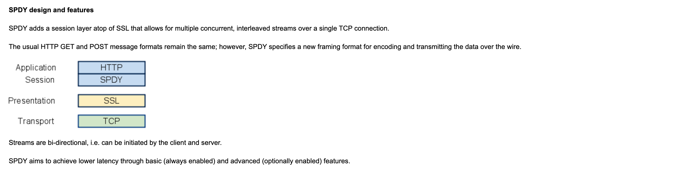

# HTTP 기반 추가 프로토콜

http은 초기엔 html 문서 전송을 위한 프로토콜로 만들어짐 => 용도가 크게 변함 but 이미 http는 광범위하게 사용하고 있으므로 추가 프로토콜을 구현하는 형태로 발전

## HTTP 병목 현상 해소하는 SPDY

구글이 만든 SPDY : http의 병목 현상 해소하고 웹 페이지 로딩 시간 단축 목표로 개발된 프로토콜.

### HTTP 병목 현상

sns를 사용하면 실시간 데이터 주고 받음 => 수많은 사람들이 사용하다 보니 단시간에 데이터들이 대량으로 갱신됨.

서버 정보 갱신 시, 빠르게 클라이언트 화면에 반영하려면 => http로는 단순하게 처리 어려움. 
http에서는 서버 정보 갱신되었는지 확인하기 위해 항상 클라이언트가 서버에 요청을 보내야 함. => 갱신되지 않은 경우 불필요한 요청 발생.

http 병목 현상

- 1개의 connection으로 1개의 request만 보낼 수 있음
- reqeust는 클라이언트에서만 시작할 수 있음
- reqeust/response 헤더를 압축하지 않고 보냄 (헤더 정보가 많을 수록 지연됨)
- 매번 같은 헤더를 보내는데, 헤더 정보가 많을 수록 중복이 발생
- 데이터 압축은 임의로 선택 가능 (압축해서 보내는 게 강제되지 않음)

### Ajax로 해결

Ajax (Asynchronous JavaScript + XML)

js나 dom 조작을 통해 웹 페이지 일부만 고쳐쓸 수 있게하는 비동기 통신 방법 => 페이지의 일부분만 갱신하므로 response로 전송되는 데이터 양이 줄어듦.

핵심 기술 : XMLHttpRequest 라는 api를 js로 서버와 http 통신

하지만 Ajax로 실시간 데이터 서버로부터 받아오려면, => 대량 request가 발생함.

### Comet으로 해결

서버 측 콘텐츠 갱신 시, 클라이언트로부터 request를 기다리지 않고 클라이언트로 보냄. 
=> 응답을 연장시켜서 서버에서 통신을 개시하는 서버 푸시 기능을 유사하게 따르고 있음.

일반적으로 requestdhaus response를 바로 반환하지만, => Comet에서는 response를 보류 상태로 두고, 서버 콘텐츠 갱신 시에 response 반환.

콘텐츠를 실시간으로 갱신할 수 있지만 => response를 보류하기 위해 connection 유지 시간이 길어짐. (커넥션 유지를 위한 리소스 소비)

### SPDY의 목표

Ajax, Comet 등 사용성 개선하는 기술들로 어느 정도 개선했지만, http라는 프로토콜 제약을 해소할 수는 없음.

=> 근본적인 문제 해결을 위해서는 프로토콜 레벨에서의 개선이 필요. SPDY는 http가 안고 있는 병목 현상을 프로토콜 레벨에서 해소하기 위한 프로토콜.

### SPDY 설계와 기능

SPDY는 HTTP를 바꾸는 게 아닌, TCP/IP의 application 계층과 transport 계층 사이에 새로운 session 계층을 추가하는 형태로 동작함.

또한, SPDY는 보안을 위해 표준으로 SSL을 사용하도록 강제함.

SPDY가 session 계층으로 들어가서 데이터 흐름은 제어하지만, http 커넥션은 확립되어 있으므로 http의 기존 기능 그대로 사용함.

### SPDY 사용 시 http에 추가할 수 있는 기능들

#### 다중화 스트림

단일 tcp 접속을 통해서 복수의 http request를 무제한으로 처리할 수 있음. (1번의 tcp 접속으로 request를 주고 받는 게 가능하므로 tcp 효율이 높아짐)

#### request의 우선 순위 부여

SPDY는 무제한으로 request를 병렬 처리할 수 있고, => 각 request에 우선순위 할당 가능. (이유는, 복수 request 보낼 때, 대역폭이 좁아지면 처리가 늦어지는 현상 해결을 위해서)

#### http 헤더 압축

request와 response의 http 헤더 압축. 보다 적은 패킷 수와 송신 바이트 수로 통신 가능해짐

#### 서버 푸시 기능

서버에서 클라이언트로 데이터 push 할 수 있음.

#### 서버 힌트 기능

서버가 클라이언트에게 request해야 할 리소스를 제안할 수 있음. => 클라이언트가 자원을 발견하기 전에 리소스 존재 알 수 있음 (캐시 데이터면 불필요한 request 할 필요x)

### SPDY는 웹 병목 현상 해결하는가?

SPDY를 사용하고 싶을 경우, 웹 콘텐츠 측은 고려할 게 없지만 웹 브라우저와 웹 서버는 SPDY에 대응하고 있을 필요 있음. => 아직은 실험적임

SPDY는 기본적으로 1개의 도메인(IP 주소)과의 통신을 다중화할 뿐, 하나의 웹에서 복수 도메인으로 리소스 사용하고 있는 경우 그 효과는 한정적임.

SPDY는 HTTP의 병목 현상을 해결하지만, 대부분 웹의 문제는 HTTP 병목 현상 때문만은 아님.

웹을 빠르게 만들기 위해 웹 콘텐츠 제작 등 부수적으로 해야 할 일들이 많음.

## 브라웢 양방향 통신하는 WebSocket

Ajax와 Comet을 사용한 통신은 웹 브라우징을 고속화하지만 http 프로토콜을 사용하는 한 병목 현상 해결x 
=> WebSocket은 새로운 프로토콜과 API로 이 문제 해결하려함.

당초 HTML5 사양 일부로 책정 => but 현재는 단독 프로토콜로서 규격 책정

### WebSocket의 설계와 기능

웹 브라우저와 웹 서버 양방향 통신 규격으로 WebSocket 프로토콜을 IETF가 책정, WebSocket API를 W3C가 책정함. 
=> Ajax나 Comet에서 사용하는 XMLHttpRequest 결점을 해결하기 위한 기술

### WebSocket 프로토콜

WebSocket은 웹 서버와 클라이언트가 1번 접속 확립 후 그 뒤 통신을 모두 전용 프로토콜을 하는 방식으로 JSON, XML, HTML이나 이미지 등 임의 형식의 데이터를 보내게 됨. 
=> http에 의한 접속 출발점이 클라이언트에 있는 건 동일, 1번 접속한 후에는 WebSocket을 사용해서 서버와 클라이언트 양방향 통신 가능.

#### 서버 푸시 기능

서버에서 클라이언트에 데이터 push 가능

#### 통신량 삭감

WebSocket은 1번 접속하면, 접속 유지하려 함. => http에 비해 자주 접속하는 오버헤드 줄임, 헤더의 사이즈도 작아서 통신량 줄임

- WebSocket 통신하려면 http에 1번 접속 후, handshake 절차 밟아야 함.

#### 핸드쉐이크/리퀘스트

WebSocket 통신하려면 http의 Upgrade 헤더 필드를 사용해서 프로토콜을 변경하는 것으로 handshake 실시.

Sec-WebSocket-Key에는 handshake에 필요한 key가 저장, Set-WebSocket-Protocol에는 사용하는 서브 프로토콜이 저장되어 있음.

서브 프로토콜은 WebSocket 프로토콜에 의한 connection을 여러 개로 구분하고 싶을 때 이름 붙여서 정의.

#### 핸드쉐이크/리스폰스

앞선 request에 대한 response는 상태코드 101 Switching Protocol로 반환됨.

Sec-WebSocket-Accept는 Sec-WebSocket-Key의 값에서 생성된 값이 저장됨.

handshake에 의해 WebSocket 커넥션이 확립된 후 => http가 아닌, WebSocket 독자적인 데이터 프레임을 이용해 통신함.

## 웹 서버 상의 파일 관리하는 WebDAV

WebDAV(Web-based Distributed Authoring and Versioning)은 웹 서버 콘텐츠에 대해, 파일 복사/편집 같은 거 할 수 있는 분산 파일 시스템 (http/1.1 확장한 프로토콜)

## 참고자료

[SPDY는 무엇인가?](https://d2.naver.com/helloworld/140351) 
[SPDY: An experimental protocol for a faster web](https://www.chromium.org/spdy/spdy-whitepaper/) 
