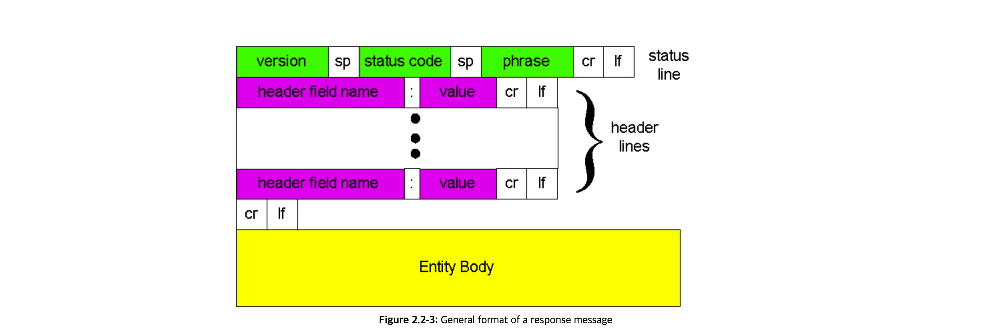
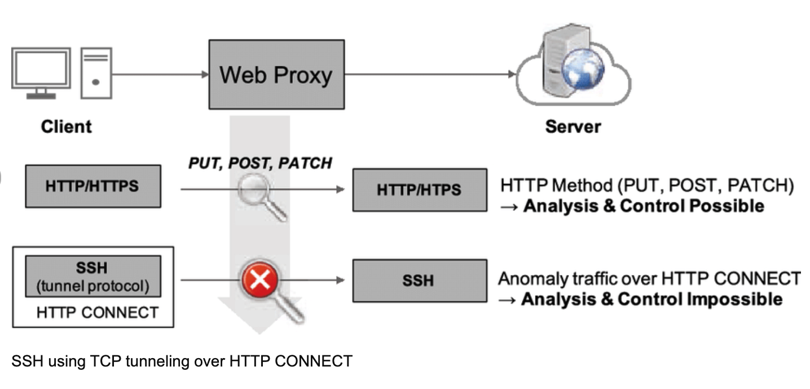
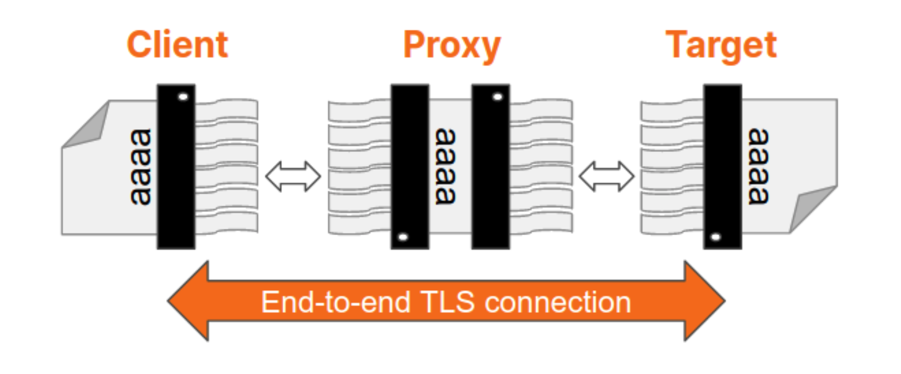

## 간단한 프로토콜 HTTP (http/1.1을 기준으로)

TCP/IP에 있는 다른 프로토콜들처럼 HTTP도 클라이언트와 서버 간에 통신을 한다. 
HTTP는 클라이언트와 서버의 역할을 명확하게 구분한다. 
통신은 반드시 클라이언트 측으로부터 시작된다.

Request Message는 `메소드`, `URI`, `프로토콜 버전`, `옵션 리퀘스트 헤더 필드`, `엔티티`로 구성되어 있다.

헤더 필드와 바디(body)는 빈 줄로 구분한다. body가 리소스 본체에 해당한다.

### HTTP는 기본적으로 상태를 유지하지 않는 프로토콜이다.

HTTP는 Stateless한 특징을 가지고 있다. 즉, 응답과 요청을 주고 받는 과정에서 상태를 관리하지 않는다. 
=> 많은 데이터를 빠르고 확실하게 처리하는 범위성(scalability)을 갖는다.

하지만 웹이 진화하면서, 상태를 관리해야 할 필요성이 생겨난다.

HTTP/1.1은 상태를 유지하지 않는 프로토콜이지만, 상태를 관리하기 위해 쿠키(Cookie)라는 기술이 도입되었다.

### Request URI는 리소스 식별을 위해 존재한다.

기본적으로 HTTP는 URI를 사용해 인터넷 상의 리소스를 지정한다. 
Request에 기본적으로 Request URI를 포함해야 한다. 방식은 다양하다.

- 모든 URI를 Request URI에 포함하거나
- 네트워크 로케이션만을 포함하거나(http:://example.com/index.html에 요청하는 경우 http://example.com만 명시)
- `OPTIONS * HTTP/1.1`과 같이 서버가 지원하고 있는 메소드를 물을 때 `*`를 사용하거나

### 다양한 HTTP Method

GET 메서드는 Request URI로 식별된 리소스를 가져오는 걸 요청한다. 소스가 텍스트면 그대로 반환하고, 프로그램이면 실행해서 내용을 돌려주기도 한다.

`POST 메서드`는 엔티티를 전송하기 위해 사용한다.

`PUT 메서드`는 파일을 전송하기 위해 사용한다.

> put 메서드가 파일을 전송한다는 게 무슨 의미냐면,
> post 방식으로 전달된 uri는 클라이언트로부터 함께 전달된 엔티티를 기반으로 처리해야 하는 오브젝트에 해당한다. 
> 반면 put은 request uri가 웹스크립트라기 보다는 파일의 이름이나 경로에 해당한다. 특정 위치에 특정 파일을 가져다 놓으려 할 때 put을 사용하곤 했다.

즉, put 메소드는 파일 업로드와 같이 엔티티를 request uri로 저장하도록 요청하는 메소드다.

- http/1.1 put 자체는 인증 기능이 없어, 누구나 파일 업로드가 가능해 일반적으로 사용하지 않는 메소드였다.
- 웹 앱에서 인증 기능과 짝을 짓거나 rest 양식일 때 사용했다.

> PUT은 주로 기존 자원의 업데이트나 특정 위치에 자원의 생성에 사용되며, POST는 서버에서 자원의 위치를 결정하는 자원 생성에 주로 사용된다.
> PUT은 멱등(Idempotent)이며, 같은 요청을 여러 번 해도 같은 결과를 가져온다. 반면, POST는 비멱등(Non-idempotent)이며, 같은 요청을 여러 번 할 경우 서로 다른 결과(예: 여러 개의 자원 생성)를 가져올 수 있다.

`HEAD 메서드`는 get과 같은 기능을 하되, message bdy는 돌려받지 않는다. uri 유효성, 리소스 갱신 시간 확인 목적으로 사용한다.

`DELETE 메서드`는 파일을 삭제하기 위해 사용한다. 파일에 대한 의미 이해는 put에서 설명한 바와 같다. 
put 메소드와 반대로 동작하며, request uri로 지정된 리소스의 삭제를 요구한다.

`OPTIONS 메서드`는 request uri로 작성한 리소스가 제공하고 있는 메소드를 조사할 때 사용한다. 
`*`를 request uri로 작성하면 서버가 지원하는 메서드를 반환받는다.

`TRACE 메서드`는 web 서버에 접속해서 자신에게 통신을 되돌려 받는 loop-back을 발생시킨다.

- 요청을 보낼 때마다, "Max-Forwards"라는 헤더 필드에 수치를 포함시키고, 통과할 때마다 이를 줄여나간다.
- 프록시 등을 사용해 origin 서버에 접속할 때 동작을 확인하기 위해 사용한다.
- XST와 같은 공격을 일으키는 보안 상 문제로 사용하지 않는다.

`CONNECT 메서드`는 프록시에 터널 접속 확립을 요청해, TCP 통신을 터널링할 때 사용한다. 
주로 SSL, TSL 등의 프로토콜로 암호화된 것을 터널링할 때 사용한다.

### 연결에 대한 오버헤드를 대처하려면

HTTP 초기버전에서는 HTTP 통신을 할 때마다 TCP에 의해 연결을 매번 종료해야 했다. 
초기에는 HTTP가 작은 사이즈의 텍스트 보내는 용도였기에 상관없었다. 
하지만 사이즈가 커지면서, 특히 브라우저가 이미지를 요청할 때 매번 request를 보낸다. 이미지가 여러 개면 매번 TCP 통신을 종료하는 게 비용이 된다.

HTTP/1.1와 일부 HTTP/1.0에서는 TCP 연결 문제를 해결하기 위해 Persistent Connections 방법을 도입했다.

- 지속적 연결을 통해 TCP 연결과 종료로 인한 오버헤드를 막아, 서버에 대한 오버헤드를 줄일 수 있다.
- 클라이언트 입장에서는 http request, response 속도가 빨라져 웹 페이지를 빨리 보여줄 수 있다.
- Persistent Connections는 http/1.1에서는 표준 동작이다.

### 쿠키(cookie)를 사용한 상태 관리

기본적으로 HTTP는 Stateless 프로토콜이지만, 상태 관리가 필요해지는 시점이 온다. 
물론 무상태성의 이점도 있다. 상태를 유지하지 않으므로 서버의 CPU나 메모리 같은 리소스 소비를 억제할 수 있다.

쿠키는 HTTP 프로토콜이 무상태성을 지닌다는 점을 남겨두면서도 상태 관리를 하기 위해 등장했다.

쿠키는 기본적으로 서버에서 굽는다.

- 쿠키를 가지지 않은 상태에서 클라이언트가 요청을 보내면, 서버는 쿠키를 발행하고 누구에게 무엇을 전달했는지 기억해둔다.
- 서버에서 응답으로 온 Set-Cookie라는 헤더 필드를 통해 클라이언트는 쿠키를 보존하고, 이후 요청을 보낼 때 Request에 쿠키가 붙는다.

## 참고자료

[2.2 The World Wide Web: HTTP](http://www2.ic.uff.br/~michael/kr1999/2-application/2_02-http.htm) 
[Tracing Messages](https://flylib.com/books/en/1.2.1.64/1/) 
[[HTTP 프로토콜 강좌]#4 HTTP 요청 방식 PUT, DELETE](https://withbundo.blogspot.com/2017/06/http-4-http-putdelete.html) 
[A Primer on Proxies](https://blog.cloudflare.com/a-primer-on-proxies) 
